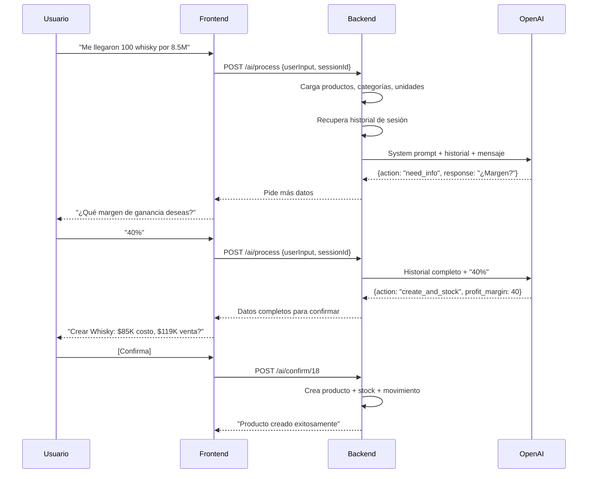

# Walos - Sistema de Gestión Comercial con IA

PWA para gestión de bar/restaurante con asistente de inteligencia artificial conversacional.

## Visión del Proyecto

Sistema integral que gestiona inventario, ventas, finanzas y proveedores para negocios de hostelería. El diferenciador principal es un **asistente de IA conversacional** que permite registrar mercancía, crear productos y consultar datos mediante lenguaje natural (texto o voz). Diseñado para escalar como **SaaS multi-tenant**.

## Estado Actual (Abril 2026)

### Módulos Implementados

| Módulo | Estado | Descripción |
|--------|--------|-------------|
| **Inventario** | ✅ Completo | CRUD productos, stock por sucursal, movimientos, alertas, imagen de producto |
| **Asistente IA** | ✅ Completo | Multi-turno con OpenAI, creación de productos, registro de stock, voz |
| **Ventas (POS)** | ✅ Completo | Mesas arrastrables, pedidos, facturación, +/- inline, división de cuenta |
| **Finanzas** | ✅ Completo | Gastos, ingresos, ventas facturadas, control mensual por periodo |
| **Configuración** | ✅ Completo | Branding (logo/nombre), 6 temas visuales, reglas de descuento |
| **Alertas** | ✅ Completo | Vista detallada por severidad, acciones rápidas, badge en header |
| **Stock Comprometido** | ✅ Completo | Mesas abiertas reservan stock; inventario muestra disponible real |
| **Auth** | ✅ Completo | Login JWT, middleware multi-tenant, session con company/branch |
| **Layout** | ✅ Completo | Sidebar colapsable, responsive mobile-first, Lucide icons |

### Pendiente / Roadmap

| Módulo | Prioridad | Descripción |
|--------|-----------|-------------|
| **Multi-tenant SaaS** | P0 | Auditoría de tenant, middleware, hardening de queries, onboarding |
| **Proveedores** | P2 | CRUD, contacto WhatsApp/email, pedido sugerido por IA |
| **Pedidos y Domicilios** | P1 | Tablero Kanban, estados operativos, IA de toma de pedidos, integraciones |
| **i18n** | P3 | Estructura preparada, traducciones pendientes (EN, ES, PT) |
| **PWA offline** | P3 | Service worker para operación sin conexión |

> Detalle completo de pendientes en [PENDING.md](PENDING.md)

## Cómo Funciona el Asistente de IA



### Acciones del Sistema

| Acción | Cuándo | Efecto |
|---|---|---|
| `add_stock` | Producto existe | Agrega stock + recalcula costo promedio ponderado |
| `create_and_stock` | Producto nuevo, datos completos | Crea producto + stock + movimiento |
| `need_info` | Faltan datos (margen, categoría, etc.) | Pide info adicional al usuario |
| `query` | Consulta informativa | Responde sin modificar datos |

### Fórmulas Clave

**Costo promedio ponderado** (al recibir stock existente):
```
nuevo_costo = (stock_actual × costo_actual + qty_nueva × costo_nuevo) / (stock_actual + qty_nueva)
```

**Precio de venta** (al crear producto nuevo):
```
precio_venta = costo_unitario × (1 + margen_ganancia / 100)
```

## Stack Tecnológico

| Capa | Tecnología | Notas |
|---|---|---|
| **Backend** | ASP.NET Core 8, Dapper, Npgsql | Clean Architecture, 4 capas |
| **Frontend** | React 18, Vite, TailwindCSS | Zustand + React Query |
| **IA** | OpenAI gpt-4 | System prompt estricto, multi-turno |
| **Auth** | JWT Bearer | Claims: companyId, userId, branchId |
| **DB** | Supabase (PostgreSQL) | Esquemas: core, inventory, sales, finance, suppliers, delivery |
| **Iconos** | Lucide React | Cero emojis en UI |
| **Notificaciones** | react-hot-toast | Top-right, 3s duration |

## Arquitectura

```
backend-dotnet/src/
├── Walos.API/                  # Controllers, Middleware, Program.cs
├── Walos.Application/          # Services, DTOs, Validators
├── Walos.Domain/               # Entities, Interfaces, Exceptions
└── Walos.Infrastructure/       # Repositories (Dapper), OpenAI Service

frontend/src/
├── modules/
│   ├── ai-assistant/           # Chat IA conversacional
│   ├── alerts/                 # Vista detallada de alertas
│   ├── auth/                   # Login
│   ├── company/                # Gestión de empresa
│   ├── finance/                # Gastos, ingresos, control mensual
│   ├── inventory/              # Productos, stock, movimientos
│   ├── sales/                  # Mesas, pedidos, facturación
│   ├── settings/               # Branding, temas, descuentos
│   ├── suppliers/              # (pendiente) Proveedores
│   └── users/                  # (pendiente) Gestión de usuarios
├── services/                   # API calls por módulo
├── stores/                     # Zustand (authStore, uiStore)
├── utils/                      # formatCurrency, helpers
└── config/api.js               # Axios + interceptores
```

Dependencias: `API → Application → Domain ← Infrastructure`

## Instalación Rápida

### Prerrequisitos
- .NET SDK 8.0
- Node.js 20+
- Cuenta en [Supabase](https://supabase.com) (o PostgreSQL local)
- OpenAI API Key

### 1. Base de Datos (Supabase)
```bash
# Ejecutar migraciones en orden en Supabase SQL Editor:
cd supabase/migrations
# 001_create_schemas → 002_core_tables → 003_inventory_tables
# → 004_sales_tables → 005_finance_tables → 006_suppliers_tables
# → 007_delivery_tables → 800_seed_initial_data
```
> Ver [supabase/migrations/README.md](supabase/migrations/README.md) para detalles.

### 2. Backend
```bash
cd backend-dotnet/src/Walos.API
cp .env.example .env
# Editar .env con tus credenciales (DB, JWT, OpenAI)
cd ../..
dotnet restore && dotnet run --project src/Walos.API
# → http://localhost:3000
```

### 3. Frontend
```bash
cd frontend
npm install
# Crear .env con: VITE_API_URL=http://localhost:3000 y VITE_API_VERSION=v1
npm run dev
# → http://localhost:5173
```

## Configuración (.env del backend)

| Variable | Descripción | Ejemplo |
|---|---|---|
| `DB_CONNECTION_STRING` | Supabase PostgreSQL connection string | `Host=db.xxx.supabase.co;Port=5432;Database=postgres;...` |
| `JWT_SECRET` | Clave JWT (min 32 chars) | `mi-clave-secreta-larga` |
| `OPENAI_API_KEY` | API Key de OpenAI | `sk-...` |
| `OPENAI_MODEL` | Modelo IA | `gpt-4` |
| `CORS_ORIGINS` | Orígenes permitidos | `http://localhost:5173` |
| `PORT` | Puerto del servidor | `3000` |

Ver detalle completo en [docs/conexiones.md](docs/conexiones.md).

## Endpoints Principales

### Auth
| Método | Ruta | Descripción |
|---|---|---|
| POST | `/api/v1/auth/login` | Login (devuelve JWT) |

### Inventario
| Método | Ruta | Descripción |
|---|---|---|
| GET | `/api/v1/inventory/products` | Listar productos |
| POST | `/api/v1/inventory/products` | Crear producto |
| PUT | `/api/v1/inventory/products/:id` | Actualizar producto |
| DELETE | `/api/v1/inventory/products/:id` | Eliminar producto (soft delete) |
| POST | `/api/v1/inventory/products/:id/image` | Subir imagen de producto |
| GET | `/api/v1/inventory/stock` | Stock por sucursal (incluye stock comprometido) |
| POST | `/api/v1/inventory/stock/add` | Agregar stock con costo promedio ponderado |
| GET | `/api/v1/inventory/alerts` | Alertas activas de stock |
| POST | `/api/v1/inventory/ai/process` | Procesar entrada con IA |
| POST | `/api/v1/inventory/ai/confirm/:id` | Confirmar acción de IA |

### Ventas
| Método | Ruta | Descripción |
|---|---|---|
| GET | `/api/v1/sales/tables` | Mesas activas con pedidos |
| POST | `/api/v1/sales/tables` | Crear mesa con productos |
| POST | `/api/v1/sales/tables/:id/invoice` | Facturar mesa |
| POST | `/api/v1/sales/tables/:id/cancel` | Cancelar mesa |
| PATCH | `/api/v1/sales/items/:id/quantity` | Actualizar cantidad de item (+/-) |
| POST | `/api/v1/sales/tables/:id/items` | Agregar productos a mesa existente |

### Finanzas
| Método | Ruta | Descripción |
|---|---|---|
| GET | `/api/v1/finance/entries` | Movimientos financieros |
| POST | `/api/v1/finance/entries` | Registrar gasto/ingreso |
| GET | `/api/v1/finance/categories` | Categorías de movimiento |
| GET | `/api/v1/finance/summary` | Resumen del periodo (ventas + ingresos - gastos) |

### Configuración
| Método | Ruta | Descripción |
|---|---|---|
| GET | `/api/v1/company/settings` | Configuración general (branding, tema) |
| PUT | `/api/v1/company/settings` | Actualizar configuración |
| GET | `/api/v1/company/settings/operations` | Reglas operativas (descuentos) |
| PUT | `/api/v1/company/settings/operations` | Actualizar reglas operativas |

Swagger disponible en: `http://localhost:3000/swagger`

## Ejemplos del Asistente

```
"Me llegaron 450 cervezas águila por 990000"
→ Detecta producto existente, calcula costo unitario $2,200, agrega stock

"Recibi 100 Whisky Jack Daniels por 8500000"
→ Detecta producto nuevo, pide margen de ganancia

"Ponle 40%"
→ Calcula venta $119,000, pide confirmación

"Muéstrame productos con stock bajo"
→ Consulta informativa, no modifica datos
```

## Base de Datos

- **Plataforma**: Supabase (PostgreSQL)
- **Driver**: Npgsql 8.0.3 + Dapper
- **Esquemas**:
  - `core` — empresas, sucursales, usuarios, roles
  - `inventory` — productos, stock, movimientos, alertas, interacciones IA
  - `sales` — mesas, órdenes, items de orden
  - `finance` — movimientos financieros, categorías
  - `suppliers` — proveedores, productos de proveedor
  - `delivery` — pedidos a domicilio, items, historial de estados
  - `audit` — (reservado para auditoría)
- **Multi-tenant**: todas las tablas de negocio tienen `company_id` con FK a `core.companies`
- **Soft delete**: `deleted_at` en tablas principales
- **Stock comprometido**: CTE en queries de inventario calcula reservas de mesas abiertas
- **Migraciones**: `supabase/migrations/` — scripts idempotentes numerados
- **Legacy**: `backend-dotnet/sql/` (SQL Server, solo referencia histórica)

Ver esquema completo en [docs/database-schema.md](docs/database-schema.md).

## Roadmap

### Fase 1 — Inventario + IA ✅
- [x] CRUD productos, stock, movimientos
- [x] Asistente IA conversacional multi-turno
- [x] Creación automática de productos por IA
- [x] Costo promedio ponderado
- [x] Margen de ganancia configurable
- [x] Alertas de stock bajo + vista detallada
- [x] Reconocimiento de voz
- [x] Imagen de producto (upload, drag & drop, cámara)
- [x] Stat cards como filtros clickeables

### Fase 2 — Auth + Layout + Branding ✅
- [x] Login JWT con UI completa
- [x] Sidebar colapsable (desktop toggle + mobile hamburguesa)
- [x] 6 temas visuales (claro, oscuro, grises, neon, pink, morado)
- [x] Upload de logo + nombre de negocio
- [x] Lucide icons en toda la app (cero emojis)

### Fase 3 — Ventas (POS) ✅
- [x] Mesas con productos, arrastrables en desktop
- [x] Grid responsivo en mobile
- [x] Facturación con descuentos configurables
- [x] +/- inline por item, agregar productos a mesa existente
- [x] División de cuenta informativa
- [x] Stock comprometido (mesas abiertas reservan inventario)

### Fase 4 — Finanzas + Configuración ✅
- [x] Registro de gastos e ingresos manuales
- [x] Ventas facturadas integradas automáticamente
- [x] Control mensual con selector de periodo
- [x] Reglas de descuento (%, monto fijo, umbral de override)

### Fase 5 — Multi-tenant SaaS � En progreso
- [x] Migración de SQL Server a Supabase (PostgreSQL)
- [x] Todas las tablas con `company_id` + FK a `core.companies`
- [x] Backend Npgsql: repositories con sintaxis PostgreSQL
- [x] `sales.order_items` con `company_id` directo
- [x] Scripts de migración idempotentes en `supabase/migrations/`
- [ ] `TenantContextMiddleware` con validación JWT + branch
- [ ] Frontend: query keys con tenant, cache aislado
- [ ] Onboarding de nuevo comercio
- [ ] Documentación técnica del modelo

### Fase 6 — Proveedores 🔜
- [ ] CRUD de proveedores con asociación a productos
- [ ] Contacto por WhatsApp y email con mensaje prearmado
- [ ] Pedido sugerido por IA basado en stock bajo
- [ ] Registro de llegada de pedido como ingreso de stock

### Fase 7 — Pedidos y Domicilios 🔜
- [ ] Tablero Kanban por estados operativos
- [ ] Crear pedidos manuales, aceptar/rechazar/preparar/despachar/entregar
- [ ] Historial de estados con comentarios
- [ ] IA de toma de pedidos (texto libre → pedido estructurado)
- [ ] Integraciones con plataformas (Rappi, Didi, Uber Eats)

### Futuro
- [ ] Dashboard/Analytics con gráficas y predicciones IA
- [ ] Gestión avanzada de usuarios y roles
- [ ] i18n (EN, ES, PT)
- [ ] PWA offline (service worker)
- [ ] Exportación de datos y reportes

## Documentación

| Doc | Contenido |
|---|---|
| [docs/STYLE_GUIDE.md](docs/STYLE_GUIDE.md) | **Guía de estilo UI/UX obligatoria** — patrones de componentes, modales, paneles, tablas, botones |
| [PENDING.md](PENDING.md) | Tareas pendientes detalladas con criterios de aceptación |
| [docs/architecture.md](docs/architecture.md) | Arquitectura, estado actual, estructura de archivos |
| [docs/ai-assistant-flow.md](docs/ai-assistant-flow.md) | Flujo completo del asistente IA, diagramas, JSONs |
| [docs/database-schema.md](docs/database-schema.md) | Esquema ER, tablas, lógica de negocio en datos |
| [docs/conexiones.md](docs/conexiones.md) | Configuración de .env, puertos, headers, auth |
| [backend-dotnet/README.md](backend-dotnet/README.md) | Detalle del backend, endpoints, manejo de errores |

## Testing

```bash
# Backend
cd backend-dotnet && dotnet test

# Frontend
cd frontend && npm test
```

## Licencia

MIT
