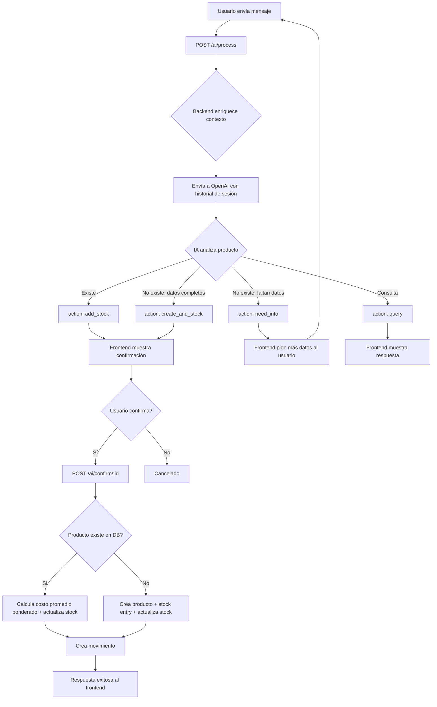

# Flujo del Asistente de IA - Walos

## Resumen

El asistente de IA permite gestionar inventario mediante lenguaje natural. Detecta si un producto existe, crea nuevos productos pidiendo datos faltantes, calcula costos promedio ponderados y registra movimientos de stock.

## Diagrama de Flujo General



## Acciones del Sistema

| Acción | Cuándo | Qué hace |
|---|---|---|
| `add_stock` | Producto existe en DB | Agrega stock, calcula costo promedio ponderado |
| `create_and_stock` | Producto no existe, datos completos | Crea producto, stock entry, agrega stock |
| `need_info` | Faltan datos obligatorios | Pide margen de ganancia, categoría, unidad, etc. |
| `query` | Consulta informativa | Responde sin modificar datos |

## Costo Promedio Ponderado

Cuando se agrega stock a un producto existente con un costo unitario diferente:

```
nuevo_costo = (stock_actual × costo_actual + cantidad_nueva × costo_nuevo) / (stock_actual + cantidad_nueva)
```

**Ejemplo:**
- Stock actual: 450 uds × $2,200
- Nuevo pedido: 500 uds × $2,500
- Promedio: (450 × 2200 + 500 × 2500) / 950 = **$2,357.89**

El `cost_price` del producto se actualiza automáticamente en la tabla `products`.

## Margen de Ganancia (Productos Nuevos)

Al crear un producto, el agente solicita el **margen de ganancia (%)** y calcula:

```
precio_venta = costo_unitario × (1 + margen / 100)
```

**Ejemplo:** Costo $85,000, margen 40% → Venta: $119,000

Fallbacks si no hay margen:
1. `profit_margin > 0` → calcula desde margen
2. `sale_price > 0` → usa precio explícito
3. Default → `cost × 1.30` (30%)

## Flujo Multi-turno (Sesiones)

Cada conversación tiene un `sessionId`. El backend:
1. Recupera las últimas 10 interacciones de la sesión desde `ai_interactions`
2. Las envía como historial de mensajes a OpenAI
3. La IA mantiene contexto entre turnos

**Ejemplo de flujo multi-turno:**
```
Usuario: "Me llegaron 100 Whisky Jack Daniels por 8500000"
IA:      "El producto no existe. ¿Qué margen de ganancia deseas?"  (need_info)

Usuario: "Ponle 40%"
IA:      "Propongo crear Whisky JD: costo $85,000, venta $119,000" (create_and_stock)

Usuario: [Confirma]
Backend: Crea producto + stock 100 uds + movimiento
```

## Estructura de Datos AI

### Request: `POST /api/v1/inventory/ai/process`
```json
{
  "userInput": "Me llegaron 54 cervezas águila por 95000",
  "inputType": "text",
  "sessionId": "uuid-opcional-para-continuidad"
}
```

### Response
```json
{
  "success": true,
  "data": {
    "interactionId": 10,
    "sessionId": "uuid-de-sesión",
    "action": "create_and_stock",
    "response": "El producto no está registrado. ¿Deseas crearlo?",
    "data": {
      "products": [
        {
          "name": "Cerveza Águila",
          "quantity": 54,
          "unit_cost": 1759.26,
          "sale_price": 0,
          "profit_margin": 0,
          "category": "Bebidas Alcohólicas",
          "unit": "Botella",
          "min_stock": 10,
          "description": "Cerveza Águila",
          "is_new": true
        }
      ],
      "total": 95000
    },
    "confidence": 95
  }
}
```

### Confirm: `POST /api/v1/inventory/ai/confirm/:interactionId`
```json
{
  "success": true,
  "message": "1 producto(s) procesado(s). Nuevos creados: Cerveza Águila (costo: $1,759, venta: $2,287, margen: 30%)",
  "data": {
    "movements": [
      {
        "productId": 8,
        "movementType": "purchase",
        "quantity": 54,
        "unitCost": 1759.26
      }
    ]
  }
}
```

## Contexto Enviado a OpenAI

El sistema prompt incluye:
- **Lista exacta** de productos registrados (nombres)
- **Categorías** disponibles
- **Unidades** disponibles
- **Empresa y sucursal** del usuario

La IA compara el producto mencionado contra la lista exacta para decidir si es nuevo o existente.

## Archivos Clave

| Archivo | Responsabilidad |
|---|---|
| `OpenAiService.cs` | System prompt, llamada a OpenAI, parseo de respuesta |
| `InventoryService.cs` | Orquesta: contexto → AI → guardar interacción → confirmar |
| `InventoryRepository.cs` | Queries SQL: stock, productos, categorías, movimientos |
| `IAiService.cs` | Interfaces y DTOs: AiProductEntry, AiContext, AiConversationMessage |
| `IInventoryRepository.cs` | Contrato del repositorio + DTOs auxiliares |
| `AIChat.jsx` | UI del chat: envío, confirmación, sesión, historial visual |
| `inventoryService.js` | Llamadas HTTP al backend desde frontend |

## Safety Nets del Backend

1. **Auto-corrección de `is_new`**: Si la IA dice `is_new: false` pero el producto no existe en DB, el backend lo trata como nuevo automáticamente.
2. **Fallback de categoría/unidad**: Si la IA no especifica categoría o unidad, se usa la primera disponible.
3. **SKU auto-generado**: Formato `AI-yyyyMMddHHmmss-N` para productos creados por IA.
4. **JSON snake_case**: Serialización/deserialización usa `JsonNamingPolicy.SnakeCaseLower` consistentemente.
