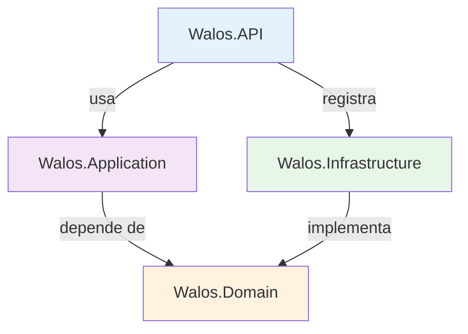

# Arquitectura del Sistema Walos

## Visión General

Sistema PWA para gestión integral de bar/restaurante con asistencia de IA. El módulo principal (inventario) permite registrar productos y stock mediante lenguaje natural, con detección automática de productos nuevos, cálculo de costo promedio ponderado y margen de ganancia.

## Estado Actual del Proyecto (Abril 2026)

### Implementado
- **Módulo de Inventario completo**: CRUD productos, stock por sucursal, movimientos, alertas
- **Asistente de IA conversacional**: procesamiento de lenguaje natural con OpenAI
- **Creación automática de productos**: detección de productos nuevos, flujo multi-turno
- **Costo promedio ponderado**: recálculo automático al recibir stock a diferente precio
- **Margen de ganancia**: el agente solicita margen y calcula precio de venta
- **Historial de sesión**: soporte multi-turno con contexto completo enviado a OpenAI
- **Autenticación JWT**: login, tokens, middleware de tenant
- **Frontend React**: chat IA, tabla de inventario, confirmación de acciones

### Pendiente
- **Login/Register UI**: actualmente se configura token en localStorage manualmente
- **Módulo de Ventas**: POS, comandas, facturación
- **Módulo de Proveedores**: catálogo, órdenes de compra
- **Dashboard/Analytics**: gráficas, reportes avanzados
- **i18n**: preparado pero no implementado
- **PWA offline**: service worker pendiente

## Principios de Diseño

- **Mobile-First**: diseño responsive comenzando por móvil
- **AI-First**: IA integrada en flujos core (no es un add-on)
- **Multi-tenant**: cada empresa aislada por `company_id` en todas las tablas
- **Clean Architecture**: capas desacopladas con inyección de dependencias

## Stack Tecnológico

### Backend (.NET 8)
| Componente | Tecnología | Uso |
|---|---|---|
| Framework | ASP.NET Core 8 | API REST |
| Data Access | Dapper | Queries SQL parametrizadas |
| Base de Datos | SQL Server | Almacenamiento principal |
| Autenticación | JWT Bearer | Tokens stateless |
| Validación | FluentValidation | Request validation |
| Logging | Serilog | Consola + archivos rotativos |
| IA | OpenAI API (gpt-3.5-turbo) | Procesamiento de lenguaje natural |
| Docs API | Swagger/OpenAPI | Documentación automática |

### Frontend (React 18)
| Componente | Tecnología | Uso |
|---|---|---|
| Build | Vite | Dev server + bundling |
| UI | TailwindCSS | Estilos utility-first |
| State | Zustand | Estado global (auth) |
| Data Fetching | React Query (TanStack) | Cache + sincronización |
| Router | React Router v6 | Navegación SPA |
| Icons | Lucide React | Iconografía |
| Speech | Web Speech API | Reconocimiento de voz |

## Arquitectura de Capas (Backend)



| Capa | Proyecto | Responsabilidad |
|---|---|---|
| **API** | `Walos.API` | Controllers, Middleware, Program.cs, configuración |
| **Application** | `Walos.Application` | Services, DTOs, Validators, orquestación de negocio |
| **Domain** | `Walos.Domain` | Entities, Interfaces, Exceptions (sin dependencias externas) |
| **Infrastructure** | `Walos.Infrastructure` | Repositories (Dapper), OpenAI Service, DB Connection |

### Flujo de una petición típica
```
HTTP Request → Controller → Service (Application) → Repository (Infrastructure) → SQL Server
                                ↓
                          IAiService (OpenAI)
```

## Estructura de Archivos

```
Walos-app/
├── backend-dotnet/
│   ├── src/
│   │   ├── Walos.API/
│   │   │   ├── Controllers/
│   │   │   │   ├── AuthController.cs       # Login, JWT
│   │   │   │   ├── HealthController.cs     # Health check
│   │   │   │   └── InventoryController.cs  # Productos, stock, IA
│   │   │   ├── Middleware/
│   │   │   │   ├── ExceptionHandlingMiddleware.cs
│   │   │   │   └── TenantContextMiddleware.cs
│   │   │   ├── Program.cs                  # DI, middleware, Kestrel
│   │   │   ├── .env                        # Variables de entorno (no en git)
│   │   │   └── .env.example                # Template de variables
│   │   ├── Walos.Application/
│   │   │   ├── DTOs/
│   │   │   │   ├── Common/ApiResponse.cs   # Respuesta estandarizada
│   │   │   │   └── Inventory/              # AiInputRequest, CreateProductRequest
│   │   │   ├── Services/
│   │   │   │   ├── IInventoryService.cs    # Interfaz + DTOs de resultado
│   │   │   │   └── InventoryService.cs     # Lógica de negocio principal
│   │   │   └── Validators/                 # FluentValidation rules
│   │   ├── Walos.Domain/
│   │   │   ├── Entities/                   # Product, Stock, Movement, AiInteraction, Alert
│   │   │   ├── Exceptions/                 # Business, NotFound, Validation
│   │   │   └── Interfaces/
│   │   │       ├── IAiService.cs           # Contrato IA + DTOs (AiProductEntry, AiContext)
│   │   │       ├── IInventoryRepository.cs # Contrato repositorio + DTOs auxiliares
│   │   │       └── IDbConnectionFactory.cs # Contrato conexión DB
│   │   └── Walos.Infrastructure/
│   │       ├── Data/SqlConnectionFactory.cs
│   │       ├── Repositories/InventoryRepository.cs  # ~650 líneas, todas las queries SQL
│   │       └── Services/OpenAiService.cs            # System prompt, llamada API, parseo
│   ├── tests/Walos.Tests/
│   └── sql/                                # Scripts SQL ordenados (001-800)
│
├── frontend/
│   ├── src/
│   │   ├── App.jsx                         # Router, rutas protegidas
│   │   ├── config/api.js                   # Axios config, interceptores auth
│   │   ├── stores/authStore.js             # Zustand: token, tenant, branch
│   │   ├── services/
│   │   │   ├── inventoryService.js         # API calls inventario + IA
│   │   │   └── authService.js              # Login API
│   │   ├── components/layout/Layout.jsx    # Sidebar, navegación
│   │   ├── hooks/useSpeechRecognition.js   # Web Speech API
│   │   └── modules/
│   │       ├── ai-assistant/
│   │       │   ├── AiAssistantPage.jsx     # Página completa del asistente
│   │       │   └── components/AIChat.jsx   # Chat IA: envío, confirmación, sesión
│   │       ├── inventory/
│   │       │   ├── InventoryPage.jsx       # Tabla de stock + alertas
│   │       │   └── components/StockTable.jsx
│   │       ├── auth/LoginPage.jsx
│   │       └── (sales, suppliers, company, users)  # Placeholders
│   └── .env                                # VITE_API_URL, VITE_API_VERSION
│
└── docs/                                   # Documentación técnica
    ├── architecture.md                     # Este archivo
    ├── ai-assistant-flow.md                # Flujo detallado del asistente IA
    ├── database-schema.md                  # Esquema ER + tablas
    └── conexiones.md                       # Configuración de conexiones
```

## Flujo de Datos Multi-tenant

Cada request autenticada incluye:
```
Headers:
  Authorization: Bearer <JWT>
  X-Tenant-ID: <company_id>     (respaldo, extraído de localStorage)
  X-Branch-ID: <branch_id>      (respaldo, extraído de localStorage)

JWT Claims (fuente principal):
  companyId, userId, branchId, username, role
```

El `TenantContextMiddleware` extrae estos valores y los hace disponibles via `HttpContext.Items`.

## Módulos del Sistema

### 1. Core (Implementado parcialmente)
- Empresas multi-tenant ✅
- Sucursales ✅
- Auth JWT (login) ✅
- Roles/Permisos (DB lista, UI pendiente)

### 2. Inventario (Implementado) ✅
- CRUD de productos
- Control de stock por sucursal
- Movimientos con trazabilidad completa
- Asistente IA conversacional multi-turno
- Creación de productos por IA con margen de ganancia
- Costo promedio ponderado automático
- Alertas de bajo stock
- Reporte de ganancias

### 3. Ventas (Pendiente)
### 4. Proveedores (Pendiente)
### 5. Analytics/Dashboard (Pendiente)

## Seguridad
- JWT con expiración configurable
- CORS configurado por variable de entorno
- Rate limiting
- Queries parametrizadas (Dapper previene SQL injection)
- Middleware de excepciones centralizado
- Secrets en `.env` (no en código)

## Performance
- Dapper (micro-ORM, cercano a raw SQL)
- Índices en todas las FK y campos de filtro frecuente
- Paginación disponible para listas grandes
- TOP 10 en historial de sesión IA (limita tokens enviados a OpenAI)
