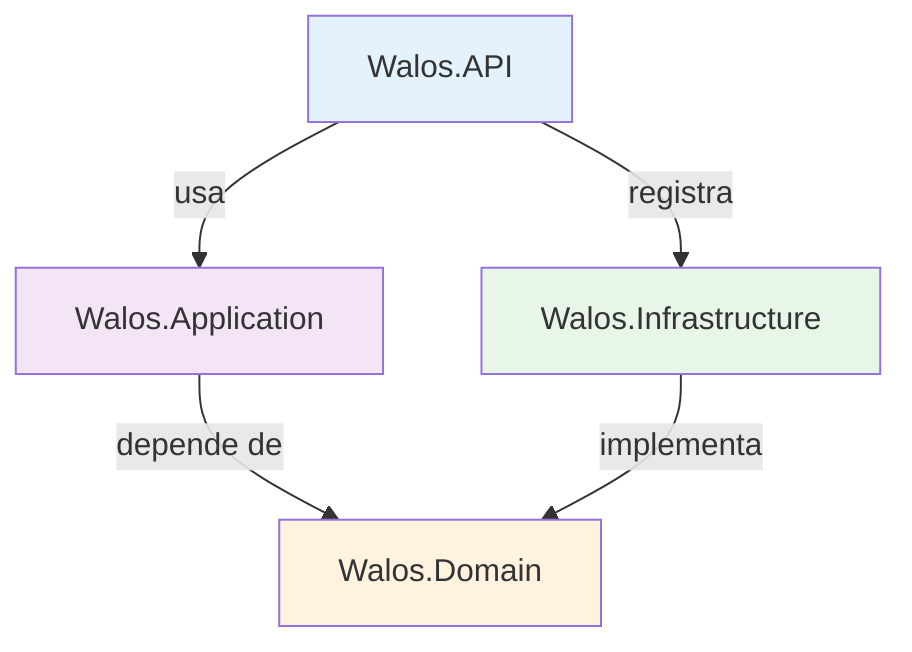

# Arquitectura del Sistema Walos

## Visión General

Sistema PWA para gestión integral de bar/restaurante con asistencia de IA. Módulos de inventario, ventas, finanzas y configuración implementados. El asistente de IA permite registrar productos y stock mediante lenguaje natural, con detección automática de productos nuevos, cálculo de costo promedio ponderado y margen de ganancia.

## Estado Actual del Proyecto (Abril 2026)

### Implementado
- **Autenticación completa**: Login UI, JWT con refresh tokens, lockout por intentos fallidos, BCrypt
- **Multi-tenant**: Aislamiento por `company_id`, `TenantContextMiddleware`, claims JWT
- **Módulo de Inventario**: CRUD productos, stock por sucursal, movimientos, alertas, tipos de producto (`simple`/`prepared`/`combo`/`service`), control de stock inteligente (`track_stock`)
- **Asistente de IA conversacional**: procesamiento de lenguaje natural con OpenAI (gpt-4), flujo multi-turno, creación automática de productos
- **Módulo de Ventas**: Mesas, pedidos, items, facturación con descuentos, cancelación, stock comprometido
- **Módulo de Finanzas**: Gastos/ingresos, categorías, plantillas recurrentes, inicialización mensual, resumen financiero
- **Configuración**: Branding (logo, nombre), 6 temas visuales, reglas de descuentos operativos
- **Alertas**: Stock bajo, severidad, acciones rápidas, badge en header
- **PWA**: Service Worker con Workbox, manifest, iconos, `NetworkOnly` para API
- **Costo promedio ponderado**: recálculo automático al recibir stock a diferente precio
- **Dashboard**: Vista general con métricas

### Pendiente
- **Módulo de Proveedores**: catálogo, órdenes de compra, contacto WhatsApp/email, IA pedidos
- **Panel Onboarding**: creación de nuevos tenants desde la app
- **Pedidos y Domicilios**: plataformas, IA, estados
- **i18n**: preparado pero no implementado (Inglés, Español, Portugués)
- **Tests**: cobertura actual mínima, necesita expansión significativa

## Principios de Diseño

- **Mobile-First**: diseño responsive comenzando por móvil
- **AI-First**: IA integrada en flujos core (no es un add-on)
- **Multi-tenant**: cada empresa aislada por `company_id` en todas las tablas
- **Clean Architecture**: capas desacopladas con inyección de dependencias

## Stack Tecnológico

### Backend (.NET 8)
| Componente | Tecnología | Uso |
|---|---|---|
| Framework | ASP.NET Core 8 | API REST |
| Data Access | Dapper + Npgsql | Queries SQL parametrizadas |
| Base de Datos | PostgreSQL (Supabase) | Almacenamiento principal |
| Autenticación | JWT Bearer + BCrypt | Tokens stateless + hash de passwords |
| Validación | FluentValidation | Request validation |
| Logging | Serilog | Consola + archivos rotativos |
| IA | OpenAI API (gpt-4, configurable) | Procesamiento de lenguaje natural |
| Docs API | Swagger/OpenAPI | Documentación automática |
| Rate Limiting | ASP.NET Core RateLimiter | Protección contra abuso |
| Compresión | ResponseCompression | Respuestas comprimidas |

### Frontend (React 18)
| Componente | Tecnología | Uso |
|---|---|---|
| Build | Vite | Dev server + bundling |
| UI | TailwindCSS | Estilos utility-first |
| State | Zustand (persist) | Estado global (auth, UI, branding) |
| Data Fetching | React Query (TanStack v5) | Cache + sincronización servidor |
| Router | React Router v6 | Navegación SPA |
| Icons | Lucide React | Iconografía |
| Notificaciones | react-hot-toast | Toasts de feedback |
| PWA | vite-plugin-pwa + Workbox | Service Worker, offline assets |
| Speech | Web Speech API | Reconocimiento de voz |

## Arquitectura de Capas (Backend)



| Capa | Proyecto | Responsabilidad |
|---|---|---|
| **API** | `Walos.API` | Controllers, Middleware, Program.cs, configuración |
| **Application** | `Walos.Application` | Services, DTOs, Validators, orquestación de negocio |
| **Domain** | `Walos.Domain` | Entities, Interfaces, Exceptions (sin dependencias externas) |
| **Infrastructure** | `Walos.Infrastructure` | Repositories (Dapper), OpenAI Service, DB Connection |

### Flujo de una petición típica
```
HTTP Request → Controller → Service (Application) → Repository (Infrastructure) → SQL Server
                                ↓
                          IAiService (OpenAI)
```

## Estructura de Archivos

```
Walos-app/
├── backend-dotnet/
│   ├── src/
│   │   ├── Walos.API/
│   │   │   ├── Controllers/
│   │   │   │   ├── AuthController.cs        # Login, JWT, refresh tokens
│   │   │   │   ├── CompanyController.cs     # Settings, branding, temas, logo
│   │   │   │   ├── FinanceController.cs     # Entries, categories, templates, month init
│   │   │   │   ├── HealthController.cs      # Health check + API info
│   │   │   │   ├── InventoryController.cs   # Productos, stock, IA, alertas, reportes
│   │   │   │   └── SalesController.cs       # Mesas, pedidos, facturación, descuentos
│   │   │   ├── Middleware/
│   │   │   │   ├── ExceptionHandlingMiddleware.cs  # Manejo global de errores
│   │   │   │   └── TenantContextMiddleware.cs      # Extrae tenant de JWT + headers
│   │   │   ├── Services/TenantContext.cs    # Implementación scoped de ITenantContext
│   │   │   ├── Program.cs                   # DI, middleware, CORS, Kestrel
│   │   │   ├── .env                         # Variables de entorno (no en git)
│   │   │   └── .env.example                 # Template de variables
│   │   ├── Walos.Application/
│   │   │   ├── DTOs/
│   │   │   │   ├── Common/ApiResponse.cs    # Respuesta estandarizada
│   │   │   │   ├── Company/                 # Settings requests
│   │   │   │   ├── Finance/                 # Entry, category, template requests
│   │   │   │   ├── Inventory/               # Product, AI, stock requests
│   │   │   │   └── Sales/                   # Table, order, invoice requests
│   │   │   ├── Services/
│   │   │   │   ├── IInventoryService.cs     # Interfaz + DTOs de resultado
│   │   │   │   └── InventoryService.cs      # Lógica de negocio inventario + IA
│   │   │   └── Validators/                  # FluentValidation rules
│   │   ├── Walos.Domain/
│   │   │   ├── Entities/                    # 15 entidades (Product, Stock, Order, etc.)
│   │   │   ├── Exceptions/                  # Business, NotFound, Validation
│   │   │   └── Interfaces/                  # 8 interfaces (repos, AI, tenant, DB)
│   │   └── Walos.Infrastructure/
│   │       ├── Data/SqlConnectionFactory.cs # Npgsql connection factory
│   │       ├── Repositories/               # 5 repos (Auth, Company, Finance, Inventory, Sales)
│   │       └── Services/OpenAiService.cs   # System prompt, llamada API, parseo
│   └── tests/Walos.Tests/                  # Unit tests (xUnit + Moq)
│
├── frontend/
│   ├── src/
│   │   ├── App.jsx                          # Router, rutas protegidas, ThemeSync
│   │   ├── index.css                        # CSS variables (6 temas) + Tailwind overrides
│   │   ├── config/api.js                    # Axios config, interceptores auth + tenant
│   │   ├── stores/
│   │   │   ├── authStore.js                 # Zustand: token, tenant, branch, permisos
│   │   │   └── uiStore.js                   # Zustand: tema, sidebar, branding
│   │   ├── services/                        # 5 services (auth, company, finance, inventory, sales)
│   │   ├── components/layout/Layout.jsx     # Sidebar colapsable, header, navegación
│   │   ├── hooks/useSpeechRecognition.js    # Web Speech API
│   │   └── modules/
│   │       ├── ai-assistant/                # Chat IA conversacional
│   │       ├── alerts/                      # AlertsPage con severidad y acciones
│   │       ├── auth/                        # LoginPage con BCrypt
│   │       ├── dashboard/                   # DashboardPage con métricas
│   │       ├── finance/                     # FinancePage + templates + month init
│   │       ├── inventory/                   # InventoryPage + CRUD + stock + reportes
│   │       ├── sales/                       # SalesPage + mesas + facturación
│   │       └── settings/                    # SettingsPage + branding + temas + descuentos
│   ├── tailwind.config.js                   # Colores dinámicos via CSS variables
│   └── vite.config.js                       # PWA config + proxy
│
├── supabase/migrations/                     # 13 scripts SQL (PostgreSQL)
│
└── docs/                                    # Documentación técnica
    ├── architecture.md                      # Este archivo
    ├── STYLE_GUIDE.md                       # Guía de estilo UI/UX obligatoria
    ├── THEME_SYSTEM_IMPLEMENTATION_GUIDE.md # Guía para replicar sistema de temas
    ├── CODE_AUDIT_REPORT.md                 # Auditoría de código y hallazgos
    ├── ai-assistant-flow.md                 # Flujo detallado del asistente IA
    ├── database-schema.md                   # Esquema ER + tablas
    ├── finance-module.md                    # Documentación módulo finanzas
    └── conexiones.md                        # Configuración de conexiones
```

## Flujo de Datos Multi-tenant

Cada request autenticada incluye:
```
Headers:
  Authorization: Bearer <JWT>
  X-Branch-ID: <branch_id>      (override opcional, extraído de localStorage)

JWT Claims (fuente principal):
  userId, companyId, branchId, name, email, role
```

El `TenantContextMiddleware` extrae claims del JWT y los inyecta en `ITenantContext` (scoped). El `BranchId` puede sobreescribirse con el header `X-Branch-ID` para cambiar de sucursal sin re-login.

## Módulos del Sistema

### 1. Core ✅
- Empresas multi-tenant con aislamiento por `company_id`
- Sucursales con header `X-Branch-ID`
- Auth JWT completo (login, refresh tokens, lockout, BCrypt)
- Roles/Permisos (DB lista, UI pendiente)
- Configuración de empresa (branding, temas, reglas operativas)

### 2. Inventario ✅
- CRUD de productos con tipos (`simple`/`prepared`/`combo`/`service`)
- Control de stock por sucursal (`track_stock` inteligente)
- Movimientos con trazabilidad completa
- Stock comprometido por mesas abiertas (`ReservedQuantity`, `AvailableQuantity`)
- Asistente IA conversacional multi-turno (OpenAI gpt-4)
- Creación automática de productos por IA con margen de ganancia
- Costo promedio ponderado automático
- Alertas de bajo stock con severidad
- Reporte de ganancias por producto

### 3. Ventas ✅
- Mesas con estado (`open`/`invoiced`/`cancelled`)
- Pedidos con items, cantidades editables
- Facturación con descuentos (fijo/porcentual) y reglas operativas
- Validación de disponibilidad vs stock comprometido
- Descuento de stock automático al facturar + registro de movimientos

### 4. Finanzas ✅
- Gastos e ingresos con categorías
- Plantillas recurrentes (mensual/quincenal/semanal)
- Inicialización mensual desde templates
- Resumen financiero con ventas del sistema integradas
- Estados: pending, posted, skipped

### 5. Configuración ✅
- Branding: logo + nombre de negocio
- 6 temas visuales (CSS variables + `data-theme`)
- Reglas de descuentos operativos (%, monto, override threshold)

### 6. Dashboard ✅
- Vista general con métricas principales

### 7. Proveedores (Pendiente)
### 8. Pedidos y Domicilios (Pendiente)
### 9. Panel Onboarding Tenant (Pendiente)

## Seguridad
- JWT con expiración configurable + refresh tokens
- BCrypt para hash de passwords
- Account lockout (5 intentos → 15 min bloqueo)
- CORS configurable por variable de entorno `CORS_ORIGINS`
- Handler explícito para preflight OPTIONS
- Rate limiting configurable
- Queries parametrizadas (Dapper previene SQL injection)
- Middleware de excepciones centralizado (stack trace solo en Development)
- Secrets en `.env` (no en código)
- Headers `Cache-Control: no-store` en respuestas API
- Upload de archivos con validación de tipo y tamaño (2MB max)

## Performance
- Dapper (micro-ORM, cercano a raw SQL)
- Npgsql con connection pooling
- Índices en todas las FK y campos de filtro frecuente
- Response compression habilitada
- PWA con precaching de assets estáticos (Workbox)
- React Query con `staleTime: 5min` para reducir re-fetches
- `LIMIT` en historial de sesión IA (limita tokens enviados a OpenAI)
