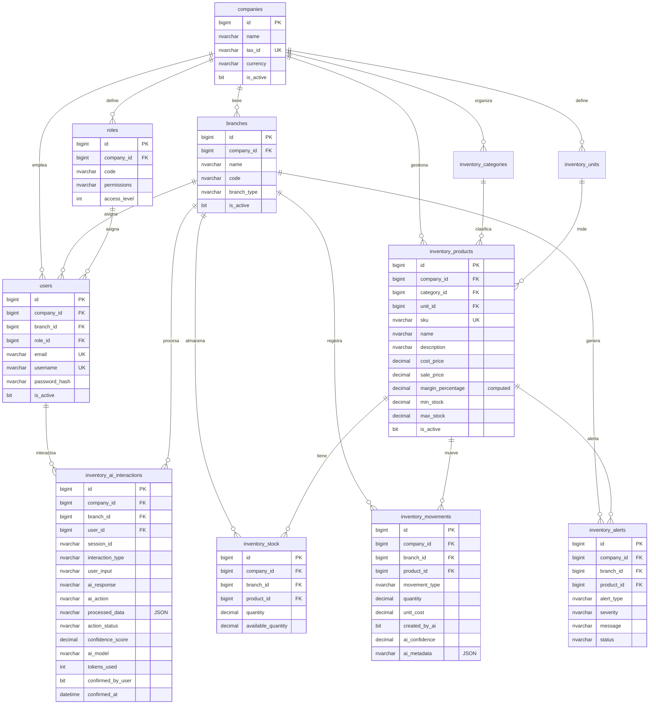

# Esquema de Base de Datos - Walos

> **Nota**: La base de datos en desarrollo se llama `SCM_App_Track_Me` (no `WalosDB`).

## Diagrama de Relaciones (Módulo Core + Inventario)



## Tablas por Esquema

### Schema: `core`
| Tabla | Descripción | Registros clave |
|---|---|---|
| **companies** | Empresas multi-tenant | company_id base para aislamiento |
| **branches** | Sucursales de cada empresa | branch_type: bar, restaurant, warehouse |
| **roles** | Roles de usuario (RBAC) | permissions como JSON |
| **users** | Usuarios del sistema | auth por username + password_hash |

### Schema: `inventory`
| Tabla | Descripción | Campos especiales |
|---|---|---|
| **categories** | Categorías de productos | name, is_active |
| **units** | Unidades de medida | name, abbreviation (ej: "Botella", "Bot") |
| **products** | Catálogo de productos | cost_price se actualiza con promedio ponderado |
| **stock** | Stock actual por sucursal | quantity se incrementa con cada compra |
| **movements** | Historial de movimientos | created_by_ai, ai_confidence, ai_metadata |
| **ai_interactions** | Interacciones con IA | session_id para multi-turno, processed_data JSON |
| **alerts** | Alertas (stock bajo, etc.) | severity: low/medium/high/critical |

## Campos Estándar

Todas las tablas incluyen:
- `id`: Primary key (BIGINT IDENTITY)
- `company_id`: Multi-tenant (FK a companies)
- `created_at`: Timestamp de creación (default GETDATE())
- `updated_at`: Timestamp de actualización
- `deleted_at`: Soft delete (NULL = activo)
- `created_by`: Usuario que creó (FK a users)
- `updated_by`: Usuario que actualizó (FK a users)

## Índices Principales

### Performance
- Todas las FK tienen índices
- `company_id` y `branch_id` indexados en todas las tablas
- `is_active` y `deleted_at` para filtros comunes
- `created_at` para ordenamiento temporal

### Búsqueda
- `email` y `username` en users (UNIQUE)
- `sku` y `barcode` en products
- `session_id` en ai_interactions (para multi-turno)

## Lógica de Negocio en Datos

### Costo Promedio Ponderado
Cuando se agrega stock a un producto existente, `products.cost_price` se recalcula:
```
nuevo_cost_price = (stock_actual × cost_price_actual + qty_nueva × cost_nuevo) / (stock_actual + qty_nueva)
```
Implementado en `InventoryService.ConfirmAiActionAsync`.

### Margen de Ganancia
Al crear un producto por IA, el `sale_price` se calcula:
```
sale_price = cost_price × (1 + profit_margin / 100)
```
El `margin_percentage` es un campo computado en DB: `(sale_price - cost_price) / cost_price * 100`.

### Tipos de Movimiento
| movement_type | Descripción |
|---|---|
| `purchase` | Compra/entrada de mercancía |
| `sale` | Venta |
| `adjustment` | Ajuste manual |
| `transfer` | Transferencia entre sucursales |
| `waste` | Merma/desperdicio |

### Estados de Interacción IA
| action_status | Significado |
|---|---|
| `pending` | Esperando confirmación del usuario |
| `success` | Confirmado y ejecutado |
| `rejected` | Rechazado por el usuario |
| `failed` | Error al ejecutar |

## Tipos de Datos JSON

### ai_interactions.processed_data
```json
{
  "products": [
    {
      "name": "Whisky Jack Daniels",
      "quantity": 100,
      "unit_cost": 85000,
      "sale_price": 119000,
      "profit_margin": 40,
      "category": "Bebidas Alcohólicas",
      "unit": "Botella",
      "min_stock": 10,
      "description": "Whisky premium",
      "is_new": true
    }
  ],
  "total": 8500000
}
```

### movements.ai_metadata
```json
{
  "interactionId": 18
}
```

### roles.permissions
```json
{
  "inventory": {"read": true, "write": true, "delete": false},
  "sales": {"read": true, "write": true},
  "reports": {"read": true}
}
```
