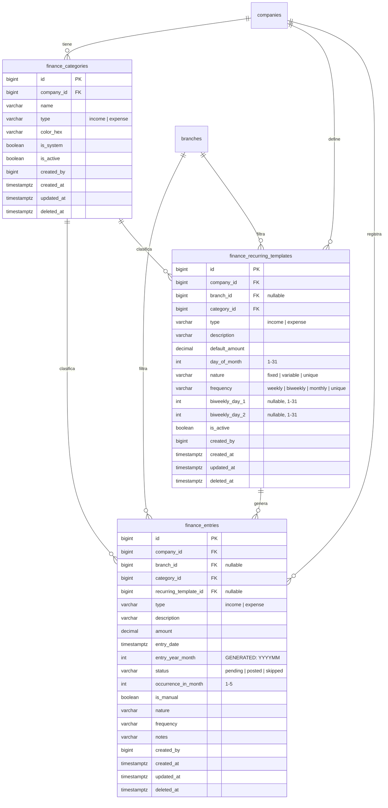
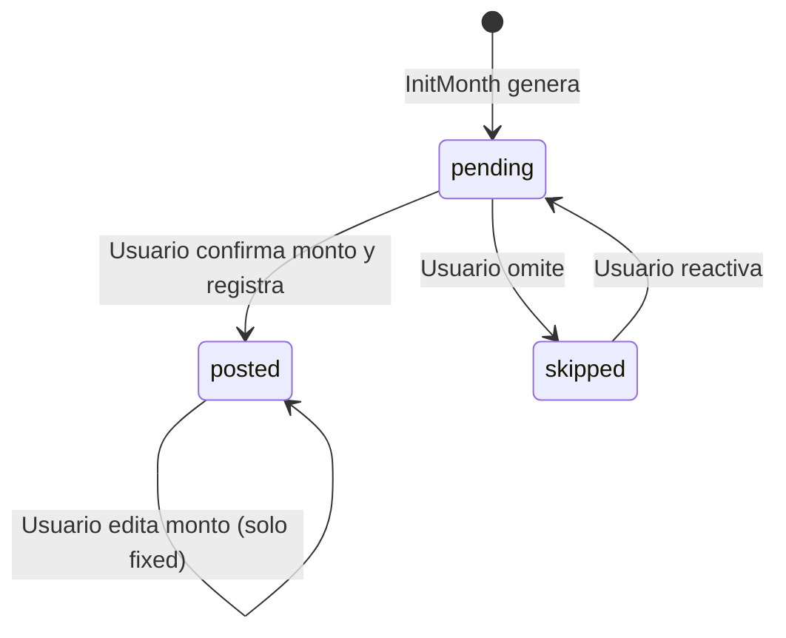
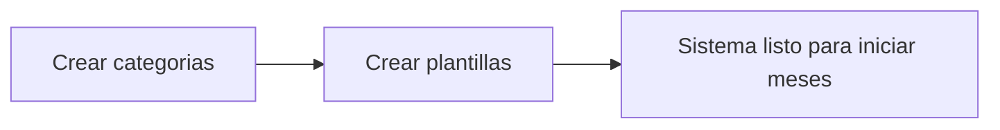
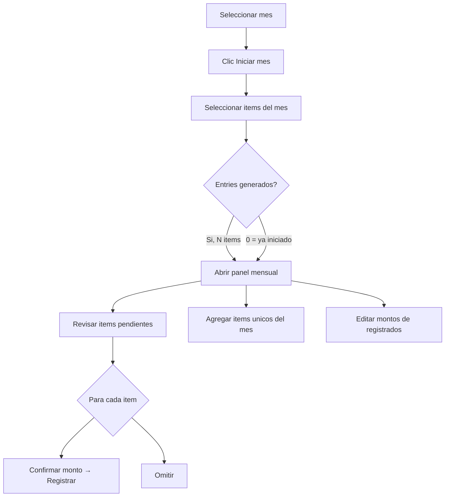
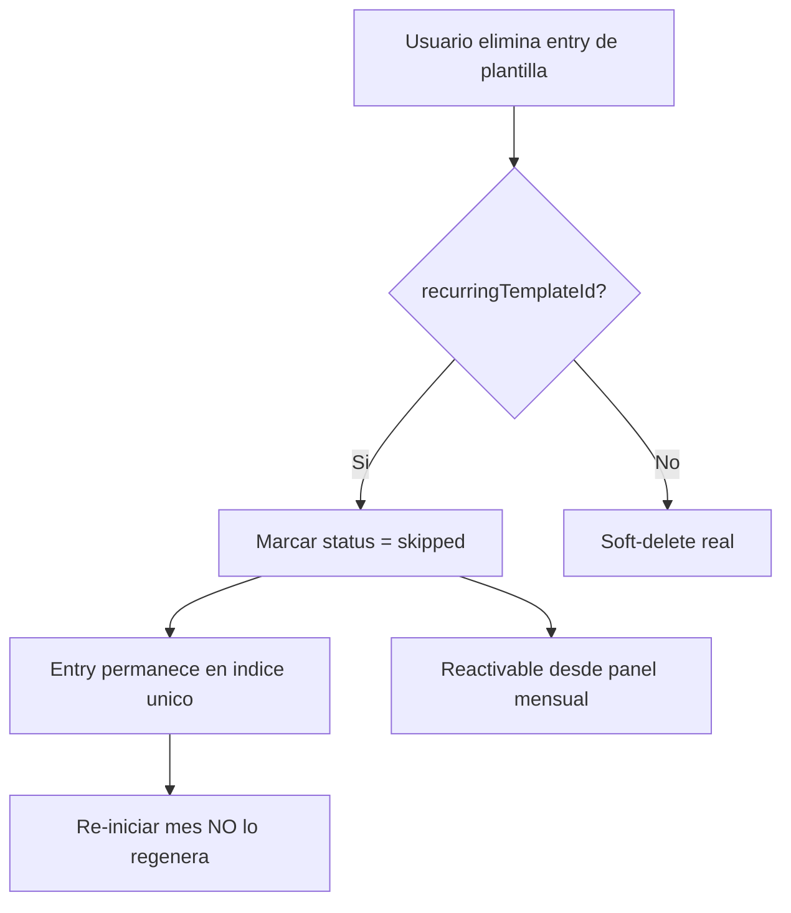

# Modulo de Finanzas — Documentacion Tecnica

> **Ultima actualizacion**: Abril 2026
> **Estado**: Produccion
> **Stack**: .NET 8 / Dapper / PostgreSQL (Supabase) + React / Tailwind / React Query
>
> **Nota de refactor**: el modulo se esta simplificando para usar `finance.categories` como catalogo principal de items financieros. Algunas secciones historicas de este documento todavia mencionan `templates`.

---

## 1. Vision General

El modulo de Finanzas permite a cada empresa (tenant) controlar ingresos y gastos mensuales mediante:

1. **Categorias financieras** — clasifican cada movimiento (Servicios, Nomina, Ventas, etc.).
2. **Items financieros** — catalogo base reutilizable mes a mes (arriendo, internet, salario empleado 1).
3. **Inicio de mes** — permite seleccionar que items incluir en el mes; los items marcados como automaticos vienen preseleccionados.
4. **Entries (movimientos)** — registros financieros reales con monto, estado y fecha; pueden ser generados desde plantillas o creados manualmente.
5. **Resumen financiero** — totales de ingresos, gastos, ventas del sistema y balance neto.

### Principio arquitectonico

```
┌─────────────────────────┐       ┌────────────────────────────────────┐
│  recurring_templates    │       │           entries                  │
│  (items permanentes)    │──1:N──│  (instancias mensuales + manuales) │
│  Arriendo, Internet...  │       │  entry_year_month = 202505         │
└─────────────────────────┘       │  entry_year_month = 202506         │
                                  │  ...                               │
                                  └────────────────────────────────────┘
```

- **Items financieros** = fuente permanente de items. Nunca se eliminan logicamente al iniciar un mes.
- **Entries** = copia independiente por mes. Cada mes obtiene sus propios registros con montos y estados autonomos.
- El campo `entry_year_month` (columna generada `YYYYMM`) + `occurrence_in_month` garantizan unicidad por mes.
- Si el usuario "elimina" un item generado desde plantilla, se marca como `skipped` (no soft-delete), evitando que se regenere al re-iniciar el mes.

---

## 2. Modelo de Datos

### 2.1 Diagrama Entidad-Relacion



### 2.2 Tabla `finance.categories`

| Campo | Tipo | Descripcion |
|---|---|---|
| `id` | BIGSERIAL PK | Identificador unico |
| `company_id` | BIGINT FK | Tenant |
| `name` | VARCHAR(150) | Nombre visible (ej: "Servicios publicos") |
| `type` | VARCHAR(20) | `income` o `expense` |
| `color_hex` | VARCHAR(20) | Color para UI (ej: `#0EA5E9`) |
| `is_system` | BOOLEAN | Categoria del sistema (no editable) |
| `is_active` | BOOLEAN | Activa/inactiva |
| `created_by` | BIGINT | Usuario creador |
| `deleted_at` | TIMESTAMPTZ | Soft-delete |

**Indices:**
- `idx_fin_categories_company_type` → `(company_id, type) WHERE deleted_at IS NULL`

### 2.3 Tabla `finance.recurring_templates`

| Campo | Tipo | Descripcion |
|---|---|---|
| `id` | BIGSERIAL PK | Identificador unico |
| `company_id` | BIGINT FK | Tenant |
| `branch_id` | BIGINT FK | Sucursal (nullable = aplica a todas) |
| `category_id` | BIGINT FK | Categoria financiera |
| `type` | VARCHAR(20) | `income` o `expense` |
| `description` | VARCHAR(250) | Nombre del item (ej: "Arriendo local") |
| `default_amount` | DECIMAL(18,2) | Monto por defecto |
| `day_of_month` | INT | Dia del mes para `monthly` (1-31) |
| `nature` | VARCHAR(20) | `fixed`, `variable`, `unique` |
| `frequency` | VARCHAR(20) | `weekly`, `biweekly`/`quincenal`, `monthly`, `unique` |
| `biweekly_day_1` | INT | Dia 1 para quincenal (ej: 1) |
| `biweekly_day_2` | INT | Dia 2 para quincenal (ej: 15) |
| `is_active` | BOOLEAN | Solo plantillas activas se generan |
| `deleted_at` | TIMESTAMPTZ | Soft-delete |

**Indices:**
- `idx_fin_rec_templates_company_branch` → `(company_id, branch_id) WHERE deleted_at IS NULL`
- `idx_fin_rec_templates_company_category` → `(company_id, category_id) WHERE deleted_at IS NULL`

#### Reglas de naturaleza

| Nature | Comportamiento en InitMonth |
|---|---|
| `fixed` | Se genera automaticamente. El usuario puede editar el monto al registrar. |
| `variable` | **NO** se genera automaticamente. Sirve solo como clasificacion; el usuario registra manualmente. |
| `unique` | Se genera una sola vez. Util para gastos puntuales previstos. |

#### Reglas de frecuencia

| Frequency | Ocurrencias por mes | Logica de fecha |
|---|---|---|
| `monthly` | 1 | `day_of_month` (ajustado al ultimo dia si el mes es corto) |
| `biweekly`/`quincenal` | 2 | `biweekly_day_1` y `biweekly_day_2` |
| `weekly` | 4-5 | Lunes de cada semana calendario dentro del mes |
| `unique` | 1 | Igual que `monthly` |

### 2.4 Tabla `finance.entries`

| Campo | Tipo | Descripcion |
|---|---|---|
| `id` | BIGSERIAL PK | Identificador unico |
| `company_id` | BIGINT FK | Tenant |
| `branch_id` | BIGINT FK | Sucursal |
| `category_id` | BIGINT FK | Categoria |
| `recurring_template_id` | BIGINT FK | Plantilla origen (NULL = manual) |
| `type` | VARCHAR(20) | `income` o `expense` |
| `description` | VARCHAR(250) | Descripcion del movimiento |
| `amount` | DECIMAL(18,2) | Monto real |
| `entry_date` | TIMESTAMPTZ | Fecha del movimiento |
| `entry_year_month` | INT | **GENERATED** `YYYYMM` (ej: 202505) |
| `status` | VARCHAR(20) | `pending`, `posted`, `skipped` |
| `occurrence_in_month` | INT | Numero de ocurrencia (1-5) |
| `is_manual` | BOOLEAN | `true` = creado por usuario, `false` = generado desde plantilla |
| `nature` | VARCHAR(20) | Copia de la naturaleza de la plantilla |
| `frequency` | VARCHAR(20) | Copia de la frecuencia de la plantilla |
| `notes` | VARCHAR(1000) | Notas opcionales |
| `deleted_at` | TIMESTAMPTZ | Soft-delete (solo para manuales) |

**Columna generada:**
```sql
entry_year_month INT GENERATED ALWAYS AS (
    (EXTRACT(YEAR FROM (entry_date AT TIME ZONE 'UTC'))::int * 100)
    + EXTRACT(MONTH FROM (entry_date AT TIME ZONE 'UTC'))::int
) STORED
```

**Indice de unicidad (previene duplicados por plantilla+mes+ocurrencia):**
```sql
CREATE UNIQUE INDEX ux_fin_entries_company_branch_template_month_occ
    ON finance.entries (
        company_id,
        COALESCE(branch_id, 0),
        recurring_template_id,
        entry_year_month,
        occurrence_in_month
    )
    WHERE deleted_at IS NULL AND recurring_template_id IS NOT NULL;
```

**Otros indices:**
- `idx_fin_entries_company_date` → `(company_id, entry_date DESC) WHERE deleted_at IS NULL`
- `idx_fin_entries_company_category` → `(company_id, category_id) WHERE deleted_at IS NULL`
- `idx_fin_entries_company_rec_template` → `(company_id, recurring_template_id) WHERE deleted_at IS NULL`
- `idx_fin_entries_company_status` → `(company_id, status) WHERE deleted_at IS NULL`

#### Estados del ciclo de vida



| Status | Significado | Acciones disponibles |
|---|---|---|
| `pending` | Generado pero no confirmado | Editar monto (fixed) → Registrar, Omitir |
| `posted` | Confirmado y registrado | Editar monto (solo fixed), ver |
| `skipped` | Omitido para este mes | Reactivar → vuelve a `pending` |

---

## 3. Migraciones SQL

| Archivo | Descripcion |
|---|---|
| `005_finance_tables.sql` | Tablas base: `finance.categories` y `finance.entries` |
| `008_finance_recurring_templates.sql` | Tabla `finance.recurring_templates`, columnas `recurring_template_id` y `entry_year_month` en entries, indice de unicidad |
| `009_finance_entries_status_and_frequency.sql` | Columnas `nature`, `frequency`, `biweekly_day_1/2` en templates; `status`, `occurrence_in_month`, `is_manual` en entries; nuevo indice con `occurrence_in_month` |

---

## 4. API REST

**Base URL**: `GET/POST/PUT/DELETE /api/v1/finance/...`
**Autenticacion**: JWT Bearer (header `Authorization`)
**Multi-tenant**: `company_id` y `branch_id` se extraen del token JWT via `ITenantContext`

### 4.1 Categorias

| Metodo | Ruta | Descripcion | Body / Query |
|---|---|---|---|
| `GET` | `/categories` | Listar categorias activas | `?type=income\|expense` (opcional) |
| `POST` | `/categories` | Crear categoria | `{ name, type, colorHex }` |
| `PUT` | `/categories/{id}` | Actualizar categoria | `{ name, type, colorHex }` |
| `DELETE` | `/categories/{id}` | Eliminar categoria (soft-delete) | — |

**Request: `CreateFinancialCategoryRequest`**
```json
{
  "name": "Servicios publicos",
  "type": "expense",
  "colorHex": "#F59E0B"
}
```

**Response:**
```json
{
  "success": true,
  "message": "Categoria creada exitosamente",
  "data": {
    "id": 1,
    "companyId": 1,
    "name": "Servicios publicos",
    "type": "expense",
    "colorHex": "#F59E0B",
    "isSystem": false,
    "isActive": true,
    "entryCount": 0,
    "totalAmount": 0
  }
}
```

### 4.2 Items Financieros

| Metodo | Ruta | Descripcion | Body / Query |
|---|---|---|---|
| `GET` | `/templates` | Listar items financieros | `?branchId=&type=` |
| `POST` | `/templates` | Crear item financiero | Ver body abajo |
| `PUT` | `/templates/{id}` | Actualizar item financiero | Ver body abajo |
| `DELETE` | `/templates/{id}` | Eliminar item financiero (soft-delete) | — |

**Request: `CreateFinancialRecurringTemplateRequest`**
```json
{
  "branchId": null,
  "categoryId": 1,
  "type": "expense",
  "description": "Arriendo local",
  "defaultAmount": 2500000.00,
  "dayOfMonth": 1,
  "nature": "fixed",
  "frequency": "monthly",
  "biweeklyDay1": null,
  "biweeklyDay2": null,
  "isActive": true
}
```

**Validaciones del servidor:**
- `type` debe ser `income` o `expense`
- `defaultAmount` > 0
- `categoryId` > 0 y debe existir con el mismo `type`
- `dayOfMonth` entre 1 y 31
- `nature` debe ser `fixed`, `variable` o `unique`
- `frequency` debe ser `weekly`, `biweekly`/`quincenal`, `monthly` o `unique`
- Si `frequency = biweekly`: `biweeklyDay1` y `biweeklyDay2` obligatorios, distintos, entre 1-31
- Plantillas con `nature = variable` no generan entries en InitMonth

### 4.3 Inicio de Mes

| Metodo | Ruta | Descripcion | Body |
|---|---|---|---|
| `POST` | `/month/init` | Generar entries del mes | `{ month, branchId, selectedTemplateIds }` |

**Request: `InitFinanceMonthRequest`**
```json
{
  "month": "2025-05",
  "branchId": null,
  "selectedTemplateIds": [1, 2, 5],
  "useSelectedTemplateIds": true
}
```

**Response:**
```json
{
  "success": true,
  "message": "Mes iniciado exitosamente",
  "data": 8
}
```
`data` = numero de entries insertados. Si el mes ya fue iniciado, devuelve `0` para los items ya cargados (ON CONFLICT DO NOTHING).

#### Logica del query `InitMonthFromRecurringTemplatesAsync`

```
1. CTE ctx         → calcula month_start, month_end, today_utc, week1_start
2. CTE templates   → selecciona items activos (no variable, no eliminados, misma branch)
                     si `selectedTemplateIds` llega con valores, usa solo esa seleccion
                     si no llega seleccion explicita, usa los items marcados como automaticos
3. CTE expanded    → expande cada plantilla segun su frecuencia:
                      • monthly/unique → 1 entry con fecha = day_of_month
                      • biweekly       → 2 entries con biweekly_day_1 y biweekly_day_2
                      • weekly          → 4-5 entries con lunes de cada semana
4. CTE filtered    → si es MES ACTUAL: solo incluye ocurrencias futuras
                      si es OTRO MES: incluye TODAS las ocurrencias
5. INSERT ... ON CONFLICT DO NOTHING → inserta sin duplicar
6. Retorna COUNT de insertados
```

**Importante — `CAST` explícito**: Todas las conversiones de tipo en el SQL usan `CAST(... AS type)` en lugar de la notacion `::type` de PostgreSQL, porque Dapper interpreta `@Param::type` como un parametro nombrado, causando errores de sintaxis.

### 4.4 Movimientos (Entries)

| Metodo | Ruta | Descripcion | Body / Query |
|---|---|---|---|
| `GET` | `/entries` | Listar movimientos | `?branchId=&type=&categoryId=&startDate=&endDate=` |
| `POST` | `/entries` | Crear movimiento manual | Ver body abajo |
| `PUT` | `/entries/{id}` | Actualizar movimiento | Ver body abajo |
| `DELETE` | `/entries/{id}` | Eliminar/omitir movimiento | — |

**Request: `CreateFinancialEntryRequest`**
```json
{
  "branchId": null,
  "categoryId": 1,
  "type": "expense",
  "description": "Pago electricidad mayo",
  "amount": 350000.00,
  "entryDate": "2025-05-15",
  "nature": "variable",
  "frequency": "monthly",
  "notes": "Factura #12345",
  "status": "posted",
  "occurrenceInMonth": 1,
  "isManual": true
}
```

**Comportamiento especial de DELETE:**
- Si el entry tiene `recurringTemplateId` → **NO se elimina**. Se marca como `status = 'skipped'`. Esto evita que se regenere al re-iniciar el mes. Se puede reactivar desde el panel mensual.
- Si el entry es manual (`recurringTemplateId = null`) → soft-delete normal (`deleted_at = NOW()`).

### 4.5 Resumen Financiero

| Metodo | Ruta | Descripcion | Query |
|---|---|---|---|
| `GET` | `/summary` | Resumen de totales | `?branchId=&startDate=&endDate=` |

**Response: `FinancialSummary`**
```json
{
  "success": true,
  "data": {
    "totalIncome": 15000000.00,
    "totalExpense": 8500000.00,
    "systemSalesTotal": 12000000.00,
    "totalBusinessIncome": 27000000.00,
    "netBalance": 18500000.00,
    "topCategoryName": "Nomina",
    "topCategoryAmount": 4500000.00
  }
}
```

---

## 5. Entidades del Dominio (.NET)

### `FinancialCategory`
```csharp
public class FinancialCategory : BaseEntity
{
    public string Name { get; set; }
    public string Type { get; set; }          // "income" | "expense"
    public string? ColorHex { get; set; }
    public bool IsSystem { get; set; }
    public bool IsActive { get; set; }
    public long? CreatedBy { get; set; }
    public int EntryCount { get; set; }       // Calculado en query (COUNT)
    public decimal TotalAmount { get; set; }  // Calculado en query (SUM)
}
```

### `FinancialRecurringTemplate`
```csharp
public class FinancialRecurringTemplate : BaseEntity
{
    public long? BranchId { get; set; }
    public long CategoryId { get; set; }
    public string Type { get; set; }            // "income" | "expense"
    public string Description { get; set; }
    public decimal DefaultAmount { get; set; }
    public int DayOfMonth { get; set; }         // 1-31
    public string Nature { get; set; }          // "fixed" | "variable" | "unique"
    public string Frequency { get; set; }       // "weekly" | "biweekly" | "monthly" | "unique"
    public int? BiweeklyDay1 { get; set; }
    public int? BiweeklyDay2 { get; set; }
    public bool IsActive { get; set; }
    public long? CreatedBy { get; set; }
    public string? CategoryName { get; set; }   // JOIN
}
```

### `FinancialEntry`
```csharp
public class FinancialEntry : BaseEntity
{
    public long? BranchId { get; set; }
    public long CategoryId { get; set; }
    public long? RecurringTemplateId { get; set; }  // null = manual
    public string Status { get; set; }               // "pending" | "posted" | "skipped"
    public int OccurrenceInMonth { get; set; }       // 1-5
    public bool IsManual { get; set; }
    public string Type { get; set; }
    public string Description { get; set; }
    public decimal Amount { get; set; }
    public DateTime EntryDate { get; set; }
    public string? Nature { get; set; }
    public string? Frequency { get; set; }
    public string? Notes { get; set; }
    public long? CreatedBy { get; set; }
    public string? CategoryName { get; set; }        // JOIN
    public string? BranchName { get; set; }          // JOIN
}
```

### `FinancialSummary`
```csharp
public class FinancialSummary
{
    public decimal TotalIncome { get; set; }
    public decimal TotalExpense { get; set; }
    public decimal SystemSalesTotal { get; set; }     // Ventas del modulo de ventas
    public decimal TotalBusinessIncome { get; set; }  // Income + Sales
    public decimal NetBalance { get; set; }           // BusinessIncome - Expense
    public string? TopCategoryName { get; set; }
    public decimal TopCategoryAmount { get; set; }
}
```

---

## 6. Repositorio (`IFinanceRepository`)

```csharp
public interface IFinanceRepository
{
    // Categorias
    Task<IEnumerable<FinancialCategory>> GetCategoriesAsync(long companyId, string? type = null);
    Task<FinancialCategory?> GetCategoryByIdAsync(long id, long companyId);
    Task<FinancialCategory> CreateCategoryAsync(FinancialCategory category);
    Task<FinancialCategory> UpdateCategoryAsync(FinancialCategory category);
    Task SoftDeleteCategoryAsync(long id, long companyId);

    // Plantillas recurrentes
    Task<IEnumerable<FinancialRecurringTemplate>> GetRecurringTemplatesAsync(...);
    Task<FinancialRecurringTemplate?> GetRecurringTemplateByIdAsync(long id, long companyId);
    Task<FinancialRecurringTemplate> CreateRecurringTemplateAsync(FinancialRecurringTemplate template);
    Task<FinancialRecurringTemplate> UpdateRecurringTemplateAsync(FinancialRecurringTemplate template);
    Task SoftDeleteRecurringTemplateAsync(long id, long companyId);

    // Inicio de mes
    Task<int> InitMonthFromRecurringTemplatesAsync(long companyId, long? branchId, DateTime monthStart, long? userId);

    // Entries
    Task<IEnumerable<FinancialEntry>> GetEntriesAsync(long companyId, long? branchId, ...);
    Task<FinancialEntry?> GetEntryByIdAsync(long id, long companyId);
    Task<FinancialEntry> CreateEntryAsync(FinancialEntry entry);
    Task<FinancialEntry> UpdateEntryAsync(FinancialEntry entry);
    Task SoftDeleteEntryAsync(long id, long companyId);

    // Resumen
    Task<FinancialSummary> GetSummaryAsync(long companyId, long? branchId, DateTime? start, DateTime? end);
}
```

Implementado en `Walos.Infrastructure.Repositories.FinanceRepository` usando Dapper con queries SQL parametrizados.

---

## 7. Frontend — Componentes React

### 7.1 Estructura de archivos

```
frontend/src/
├── modules/finance/
│   ├── FinancePage.jsx                    # Pagina principal del modulo
│   └── components/
│       ├── FinancialEntryTable.jsx        # Tabla de movimientos
│       ├── FinancialEntryFormModal.jsx    # Modal crear/editar movimiento manual
│       ├── FinancialCategoryModal.jsx     # Modal crear/editar categoria
│       ├── MonthInitPanelModal.jsx        # Panel de control mensual
│       └── RecurringTemplatesModal.jsx    # Modal CRUD de plantillas
├── services/
│   └── financeService.js                  # Servicio HTTP para la API
└── utils/
    └── formatCurrency.js                  # Formateo de moneda
```

### 7.2 `FinancePage.jsx` — Pagina principal

**Estado:**
- `filters.selectedMonth` — mes seleccionado (YYYY-MM), default mes actual
- `filters.type` — filtro por tipo (income/expense)
- `filters.categoryId` — filtro por categoria

**Queries React Query:**
- `finance-entries` — movimientos filtrados por mes, tipo, categoria, sucursal
- `finance-categories` — categorias activas
- `finance-templates` — items financieros de la sucursal

**Acciones principales:**
- **Iniciar mes** → `POST /month/init` con el mes seleccionado → abre MonthInitPanelModal
- **Nuevo movimiento** → abre FinancialEntryFormModal
- **Categorias** → abre FinancialCategoryModal
- **Items financieros** → abre RecurringTemplatesModal
- **Navegacion temporal** → botones "Mes anterior", "Mes actual", selector `<input type="month">`

### 7.3 `FinancialEntryTable.jsx` — Tabla de movimientos

Muestra todos los entries del mes seleccionado en formato tabla con columnas:
Fecha | Estado | Tipo | Categoria | Descripcion | Sucursal | Ocurrencia | Naturaleza | Monto | Acciones

**Diferenciacion visual por origen:**
- Entries de plantilla: icono 🔄 (`Repeat`) junto a la descripcion
- Boton eliminar:
  - **Plantilla** → icono `CircleSlash2` + tooltip "Omitir del mes" (marca como skipped)
  - **Manual** → icono `Trash2` + tooltip "Eliminar" (soft-delete real)

**Badges de estado:**
- `pending` → amarillo
- `posted` → verde
- `skipped` → gris

### 7.4 `MonthInitPanelModal.jsx` — Panel de control mensual

Modal que muestra TODOS los entries del mes agrupados por estado:

**Grupo Pendientes (amarillo):**
- Input editable de monto (solo si `nature = fixed`)
- Boton "Confirmar monto" → habilita "Registrar"
- Boton "Registrar" → `status: posted`
- Boton "Omitir" → `status: skipped`

**Grupo Registrados (verde):**
- Monto visible con boton "Editar" (solo si `nature = fixed`)
- Edicion inline del monto con "Guardar" / "Cancelar"

**Grupo Omitidos (gris):**
- Boton "Reactivar" → `status: pending`

**Agregar item unico:**
- Formulario rapido (tipo, descripcion, monto, categoria)
- Crea entry manual con `nature: unique`, `status: pending`

### 7.5 `RecurringTemplatesModal.jsx` — CRUD de items financieros

Layout dividido en dos columnas:
- **Izquierda**: lista de items existentes con badge de estado y auto-inclusion mensual
- **Derecha**: formulario de creacion/edicion

**Campos del formulario:**
- Tipo (income/expense)
- Categoria (filtrada por tipo)
- Descripcion
- Monto default
- Naturaleza (fixed/variable/unique)
- Periodicidad (weekly/biweekly/monthly/unique)
- Dia del mes (solo monthly)
- Dia 1 y Dia 2 (solo biweekly)
- Activa (checkbox)

### 7.6 `FinancialEntryFormModal.jsx` — Movimiento manual

Formulario completo para crear/editar entries manuales:
Tipo | Categoria | Descripcion | Monto | Fecha | Naturaleza | Periodicidad | Notas

### 7.7 `FinancialCategoryModal.jsx` — Categoria

Formulario simple: Nombre | Tipo | Color (color picker)
Boton eliminar visible solo si no es categoria del sistema.

### 7.8 `financeService.js` — Servicio HTTP

```javascript
financeService = {
  getEntries(filters)            // GET  /finance/entries?...
  createEntry(payload)           // POST /finance/entries
  updateEntry(id, payload)       // PUT  /finance/entries/:id
  deleteEntry(id)                // DELETE /finance/entries/:id

  getCategories(type?)           // GET  /finance/categories?type=
  createCategory(payload)        // POST /finance/categories
  updateCategory(id, payload)    // PUT  /finance/categories/:id
  deleteCategory(id)             // DELETE /finance/categories/:id

  getSummary(filters)            // GET  /finance/summary?...

  getTemplates(filters)          // GET  /finance/templates?...
  createTemplate(payload)        // POST /finance/templates
  updateTemplate(id, payload)    // PUT  /finance/templates/:id
  deleteTemplate(id)             // DELETE /finance/templates/:id

  initMonth(payload)             // POST /finance/month/init
}
```

---

## 8. Flujos de Usuario

### 8.1 Configuracion inicial (una sola vez)



1. Ir a Finanzas → "Categorias" → crear categorias (ej: Nomina, Servicios, Arriendo)
2. Ir a "Items financieros" → crear los items base vinculados a categorias
3. Configurar naturaleza, frecuencia, dia del mes y monto default

### 8.2 Ciclo mensual



### 8.3 Eliminacion de items de plantilla



---

## 9. Consideraciones Tecnicas

### 9.1 Multi-tenant
- Todas las queries filtran por `company_id` extraido del JWT
- `branch_id` se filtra opcionalmente (plantillas con `branch_id = NULL` aplican a todas las sucursales)

### 9.2 Idempotencia de InitMonth
- `ON CONFLICT DO NOTHING` garantiza que llamar InitMonth multiples veces para el mismo mes es seguro
- El indice unico `(company_id, branch_id, recurring_template_id, entry_year_month, occurrence_in_month)` previene duplicados
- Entries con `deleted_at IS NOT NULL` se excluyen del indice, pero entries de plantilla nunca se soft-deletean (se marcan como skipped)

### 9.3 Compatibilidad Dapper
- El query SQL de InitMonth usa `CAST(... AS type)` en lugar de `::type` para evitar conflictos con la sintaxis de parametros de Dapper (`@Param`)
- Usa `make_interval(days => N)` en lugar de multiplicacion de intervals para evitar casts implicitos

### 9.4 Dark Mode
- Todos los componentes usan clases Tailwind (`text-gray-900`, `bg-white`, etc.) que se sobreescriben automaticamente via CSS variables en `index.css`
- Los colores semanticos (green, yellow, red, blue, orange) tienen overrides especificos para `[data-theme='dark']` y `[data-theme='neon']`
- Sombras se convierten en bordes sutiles en temas oscuros

---

## 10. Archivos del Modulo

### Backend
| Archivo | Descripcion |
|---|---|
| `Walos.API/Controllers/FinanceController.cs` | Controlador REST (350 lineas) |
| `Walos.Domain/Entities/FinancialCategory.cs` | Entidad categoria |
| `Walos.Domain/Entities/FinancialEntry.cs` | Entidad entry |
| `Walos.Domain/Entities/FinancialRecurringTemplate.cs` | Entidad plantilla |
| `Walos.Domain/Entities/FinancialSummary.cs` | DTO resumen |
| `Walos.Domain/Interfaces/IFinanceRepository.cs` | Contrato del repositorio |
| `Walos.Infrastructure/Repositories/FinanceRepository.cs` | Implementacion con Dapper (840 lineas) |
| `Walos.Application/DTOs/Finance/FinanceRequests.cs` | DTOs de request |

### Frontend
| Archivo | Descripcion |
|---|---|
| `modules/finance/FinancePage.jsx` | Pagina principal (290 lineas) |
| `modules/finance/components/FinancialEntryTable.jsx` | Tabla de entries (112 lineas) |
| `modules/finance/components/FinancialEntryFormModal.jsx` | Modal entry manual (120 lineas) |
| `modules/finance/components/FinancialCategoryModal.jsx` | Modal categoria (76 lineas) |
| `modules/finance/components/MonthInitPanelModal.jsx` | Panel mensual (403 lineas) |
| `modules/finance/components/RecurringTemplatesModal.jsx` | CRUD plantillas (404 lineas) |
| `services/financeService.js` | Servicio HTTP (78 lineas) |

### Migraciones
| Archivo | Descripcion |
|---|---|
| `supabase/migrations/005_finance_tables.sql` | Tablas base |
| `supabase/migrations/008_finance_recurring_templates.sql` | Plantillas + vinculacion |
| `supabase/migrations/009_finance_entries_status_and_frequency.sql` | Estados + frecuencias |
