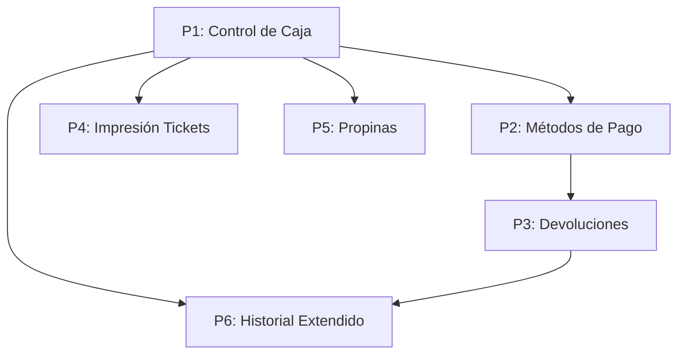

# Funcionalidades POS — Roadmap y Estado

> Estado: **Fase 1 ✅ | Fase 2 ✅ | Fase 3 ⏳ Pendiente**  
> Creado: 2026-04-25  
> Última actualización: 2026-05-06  
> Contexto: Auditoría completa del proyecto Walos contra estándares de sistema POS  
> Guía de ejecución Fase 3: `docs/fase3-execution-guide.md`

---

## Inventario de lo que YA existe

| Módulo | Componentes | Estado |
|--------|-------------|--------|
| Ventas / Mesas | Crear, renombrar, cancelar, facturar, agregar ítems | ✅ Completo |
| Descuentos | Porcentaje/fijo, límites, override, reglas por empresa | ✅ Completo |
| Crédito en Mesas | Pago parcial, abonos, panel de gestión | ✅ Completo |
| **Control de Caja** | Apertura/cierre, arqueo, reporte Z | ✅ Completo (Fase 1) |
| **Métodos de Pago POS** | Efectivo, tarjeta, transferencia, mixto | ✅ Completo (Fase 1) |
| **Propinas** | Propina voluntaria 10%/15%/custom en InvoicePanel | ✅ Completo (Fase 2) |
| **Devoluciones** | Anulación total/parcial, reversión stock, RefundModal | ✅ Completo (Fase 2) |
| Inventario | CRUD productos, stock multi-sucursal, movimientos, recetas, import Excel | ✅ Completo |
| Delivery | Pedidos con flujo de estados completo | ✅ Completo |
| Finanzas | Categorías recurrentes, entradas I/E, resumen | ✅ Completo |
| Multi-tenant | Compañías, sucursales, roles, usuarios | ✅ Completo |
| Platform B2B | Billing, suscripciones, API keys IA, métodos de pago | ✅ Completo |
| Asistente IA | Sesiones, interacciones, orquestador | ✅ Completo |
| Auth | JWT, refresh token, bloqueo por intentos | ✅ Completo |

---

## Funcionalidades POS Faltantes — Ordenadas por Prioridad

---

## 🔴 P1 — CONTROL DE CAJA (Cash Register / Shift Management)

### ¿Por qué es crítico?
Sin control de caja, **no hay trazabilidad del efectivo**. Un POS sin apertura/cierre de caja es inoperable para contabilidad. Es la funcionalidad #1 que cualquier comercio audita.

### Especificación

#### Concepto
Cada cajero abre un **turno de caja** con un monto base. Durante el turno, todas las ventas se asocian a esa caja. Al cerrar, se hace un **arqueo** (conteo físico vs. sistema) y se genera un **reporte Z**.

#### Flujo de usuario
```
Cajero inicia sesión → "Abrir Caja"
  ├── Ingresa monto base (efectivo inicial)
  ├── Sistema registra apertura: hora, usuario, sucursal, monto
  └── Caja queda en estado "open"

Durante el turno:
  ├── Cada venta facturada se asocia al cash_register_id activo
  ├── El cajero puede registrar "entradas" (ej: cambio adicional)
  ├── El cajero puede registrar "salidas" (ej: pago a proveedor en efectivo)
  └── Consulta en tiempo real: total esperado en caja

Cierre de caja:
  ├── Cajero ingresa conteo real (por denominación o total)
  ├── Sistema calcula diferencia (sobrante/faltante)
  ├── Se genera reporte Z (resumen del turno)
  └── Caja pasa a estado "closed"
```

#### Modelo de datos

**Tabla: `sales.cash_registers`**
```sql
CREATE TABLE sales.cash_registers (
    id              BIGSERIAL PRIMARY KEY,
    company_id      BIGINT NOT NULL REFERENCES core.companies(id),
    branch_id       BIGINT NOT NULL REFERENCES core.branches(id),
    opened_by       BIGINT NOT NULL REFERENCES core.users(id),
    closed_by       BIGINT REFERENCES core.users(id),

    status          VARCHAR(20) NOT NULL DEFAULT 'open',
    -- open | closed

    opening_amount  DECIMAL(18,2) NOT NULL DEFAULT 0,
    closing_amount  DECIMAL(18,2),              -- conteo real del cajero

    expected_cash   DECIMAL(18,2),              -- calculado al cierre
    difference      DECIMAL(18,2),              -- closing - expected (+ sobrante, - faltante)

    total_sales     DECIMAL(18,2) NOT NULL DEFAULT 0,
    total_cash_sales    DECIMAL(18,2) NOT NULL DEFAULT 0,
    total_card_sales    DECIMAL(18,2) NOT NULL DEFAULT 0,
    total_other_sales   DECIMAL(18,2) NOT NULL DEFAULT 0,
    total_discounts     DECIMAL(18,2) NOT NULL DEFAULT 0,
    total_credits       DECIMAL(18,2) NOT NULL DEFAULT 0,

    cash_in         DECIMAL(18,2) NOT NULL DEFAULT 0,   -- entradas manuales
    cash_out        DECIMAL(18,2) NOT NULL DEFAULT 0,   -- salidas manuales
    order_count     INT NOT NULL DEFAULT 0,

    notes           TEXT,

    opened_at       TIMESTAMPTZ NOT NULL DEFAULT NOW(),
    closed_at       TIMESTAMPTZ,
    created_at      TIMESTAMPTZ NOT NULL DEFAULT NOW(),
    updated_at      TIMESTAMPTZ NOT NULL DEFAULT NOW(),
    deleted_at      TIMESTAMPTZ
);

CREATE INDEX idx_cash_registers_company ON sales.cash_registers (company_id, branch_id, status);
CREATE INDEX idx_cash_registers_user ON sales.cash_registers (opened_by, status);
```

**Tabla: `sales.cash_movements`** (entradas/salidas manuales de caja)
```sql
CREATE TABLE sales.cash_movements (
    id              BIGSERIAL PRIMARY KEY,
    company_id      BIGINT NOT NULL REFERENCES core.companies(id),
    cash_register_id BIGINT NOT NULL REFERENCES sales.cash_registers(id),

    type            VARCHAR(10) NOT NULL,       -- in | out
    amount          DECIMAL(18,2) NOT NULL,
    reason          VARCHAR(300) NOT NULL,
    notes           TEXT,

    created_by      BIGINT NOT NULL REFERENCES core.users(id),
    created_at      TIMESTAMPTZ NOT NULL DEFAULT NOW()
);

CREATE INDEX idx_cash_movements_register ON sales.cash_movements (cash_register_id);
```

**Columna nueva en `sales.orders`:**
```sql
ALTER TABLE sales.orders ADD COLUMN IF NOT EXISTS cash_register_id BIGINT REFERENCES sales.cash_registers(id);
ALTER TABLE sales.orders ADD COLUMN IF NOT EXISTS payment_method VARCHAR(20) DEFAULT 'cash';
-- cash | card | transfer | mixed | other
```

#### Backend — Reglas IRROMPIBLES

1. **NUNCA** se puede facturar una mesa si el usuario no tiene una caja abierta. `InvoiceTableAsync` DEBE verificar `cash_register_id` activo.
2. **NUNCA** puede haber dos cajas abiertas para el mismo usuario en la misma sucursal.
3. Al cerrar caja, `expected_cash = opening_amount + total_cash_sales + cash_in - cash_out - total_credits`.
4. El reporte Z es **inmutable**: una vez generado, no se edita.
5. `cash_register_id` se inyecta automáticamente en cada orden al facturar — el cajero NO lo selecciona.

#### Backend — Estructura

**Interfaz:** `ICashRegisterRepository`
```
OpenAsync(companyId, branchId, userId, openingAmount) → CashRegister
GetActiveByUserAsync(companyId, branchId, userId) → CashRegister?
CloseAsync(id, companyId, closingAmount, notes) → CashRegister
AddMovementAsync(CashMovement) → CashMovement
GetMovementsAsync(cashRegisterId) → IEnumerable<CashMovement>
GetShiftSummaryAsync(id) → ShiftSummary
```

**Servicio:** `ICashRegisterService`
- Validaciones de negocio: caja duplicada, montos negativos, cierre sin abrir.
- Calcula `expected_cash` y `difference` al cierre.
- Genera resumen consolidado (reporte Z).

**Controlador:** `CashRegisterController`
```
POST   /api/v1/sales/cash-register/open          — Abrir caja
GET    /api/v1/sales/cash-register/active         — Caja activa del usuario
POST   /api/v1/sales/cash-register/close          — Cerrar caja
POST   /api/v1/sales/cash-register/movement       — Entrada/salida manual
GET    /api/v1/sales/cash-register/{id}/summary    — Reporte Z
GET    /api/v1/sales/cash-register/history         — Historial de turnos
```

#### Frontend

**Componentes:**
- `CashRegisterBar.jsx` — barra superior indicando caja abierta/cerrada con totales en vivo
- `OpenCashRegisterModal.jsx` — modal al iniciar turno
- `CloseCashRegisterModal.jsx` — formulario de arqueo con conteo por denominación
- `CashRegisterHistory.jsx` — listado de turnos previos con resumen
- `CashMovementModal.jsx` — registrar entrada/salida rápida

**Impacto en ventas:**
- `SalesPage.jsx` DEBE bloquear la interfaz de mesas si no hay caja abierta.
- `InvoicePanel.jsx` DEBE incluir selector de método de pago (cash/card/transfer).

#### Orden de ejecución

| # | Tarea | Estimado |
|---|-------|----------|
| 1 | Migración SQL (`016_cash_registers.sql`) | 0.5 sesión |
| 2 | Columnas nuevas en `sales.orders` | 0.5 sesión |
| 3 | Entidad + Repo + Service backend | 1 sesión |
| 4 | Controlador + DTOs | 0.5 sesión |
| 5 | Ajustar `InvoiceTableAsync` (requiere caja abierta + payment_method) | 1 sesión |
| 6 | Frontend: modal apertura/cierre + barra estado | 1.5 sesiones |
| 7 | Frontend: bloqueo de ventas sin caja | 0.5 sesión |
| 8 | Tests | 1 sesión |

---

## 🔴 P2 — MÉTODOS DE PAGO EN PUNTO DE VENTA

### ¿Por qué es crítico?
Actualmente `sales.orders` **no registra cómo pagó el cliente**. Un restaurante necesita saber cuánto entró en efectivo, cuánto en tarjeta, cuánto en transferencia. Sin esto, el control de caja es incompleto.

### Especificación

#### Concepto
Al facturar una mesa, el cajero **DEBE** seleccionar el método de pago. Si el pago es mixto (ej: parte efectivo, parte tarjeta), se registran los montos parciales.

#### Modelo de datos

**Tabla: `sales.order_payments`** (pagos asociados a una orden)
```sql
CREATE TABLE sales.order_payments (
    id              BIGSERIAL PRIMARY KEY,
    company_id      BIGINT NOT NULL REFERENCES core.companies(id),
    order_id        BIGINT NOT NULL REFERENCES sales.orders(id),

    method          VARCHAR(20) NOT NULL,       -- cash | card | transfer | nequi | other
    amount          DECIMAL(18,2) NOT NULL,
    reference       VARCHAR(200),               -- ref. transferencia, aprobación TC

    created_at      TIMESTAMPTZ NOT NULL DEFAULT NOW()
);

CREATE INDEX idx_order_payments_order ON sales.order_payments (order_id);
CREATE INDEX idx_order_payments_method ON sales.order_payments (company_id, method, created_at);
```

#### Backend — Reglas IRROMPIBLES

1. La **suma** de los pagos DEBE ser igual a `FinalTotalPaid`. No se acepta diferencia > $1.
2. Si hay crédito, el pago registrado es solo la parte efectivamente cobrada.
3. Los métodos válidos se configuran por empresa (futuro), por ahora hardcodeado: `cash`, `card`, `transfer`, `nequi`, `other`.
4. En pago mixto, CADA línea de pago se inserta como registro independiente.

#### Backend — Cambios

- `InvoiceTableRequest` agrega: `List<PaymentLine> Payments` con `{Method, Amount, Reference?}`.
- `InvoiceTableAsync` inserta en `sales.order_payments` después de completar la orden.
- `SalesSummary` incluye desglose por método de pago.
- El reporte Z del control de caja agrupa por método.

#### Frontend — Cambios

- `InvoicePanel.jsx`: selector de método de pago. Si selecciona "Mixto", muestra líneas para ingresar monto por método.
- `SalesSummaryTab.jsx`: gráfico de torta con distribución por método de pago.

#### Orden de ejecución

| # | Tarea | Estimado |
|---|-------|----------|
| 1 | Migración SQL (tabla `sales.order_payments` + columna en orders) | 0.5 sesión |
| 2 | Entidad `OrderPayment` + ajuste a DTOs | 0.5 sesión |
| 3 | Ajustar `InvoiceTableAsync` para insertar pagos | 0.5 sesión |
| 4 | Ajustar `SalesSummary` con desglose por método | 0.5 sesión |
| 5 | Frontend: selector de pago en InvoicePanel | 1 sesión |
| 6 | Frontend: desglose en resumen de ventas | 0.5 sesión |

> **DEPENDENCIA**: Se ejecuta junto con P1 (Control de Caja). Son inseparables.

---

## 🟡 P3 — DEVOLUCIONES / ANULACIONES

### ¿Por qué importa?
Hoy una venta completada **no se puede revertir**. Si hubo un error o el cliente devuelve un producto, no hay mecanismo para anular parcial o totalmente. El inventario queda descontado incorrectamente y las finanzas no cuadran.

### Especificación

#### Concepto
Un usuario con permisos puede **anular** una orden completada. La anulación:
- Revierte el stock (total o parcial)
- Registra un movimiento inverso en inventario
- Crea un registro de anulación con motivo obligatorio
- Ajusta el resumen de ventas del día

#### Modelo de datos

**Tabla: `sales.refunds`**
```sql
CREATE TABLE sales.refunds (
    id              BIGSERIAL PRIMARY KEY,
    company_id      BIGINT NOT NULL REFERENCES core.companies(id),
    branch_id       BIGINT NOT NULL REFERENCES core.branches(id),
    order_id        BIGINT NOT NULL REFERENCES sales.orders(id),

    refund_type     VARCHAR(20) NOT NULL,       -- full | partial
    refund_amount   DECIMAL(18,2) NOT NULL,
    reason          VARCHAR(500) NOT NULL,       -- OBLIGATORIO
    status          VARCHAR(20) NOT NULL DEFAULT 'completed',
    -- completed | pending_approval

    approved_by     BIGINT REFERENCES core.users(id),

    created_by      BIGINT NOT NULL REFERENCES core.users(id),
    created_at      TIMESTAMPTZ NOT NULL DEFAULT NOW()
);

CREATE INDEX idx_refunds_order ON sales.refunds (order_id);
CREATE INDEX idx_refunds_company ON sales.refunds (company_id, created_at DESC);
```

**Tabla: `sales.refund_items`** (ítems devueltos en anulación parcial)
```sql
CREATE TABLE sales.refund_items (
    id              BIGSERIAL PRIMARY KEY,
    refund_id       BIGINT NOT NULL REFERENCES sales.refunds(id) ON DELETE CASCADE,
    order_item_id   BIGINT NOT NULL REFERENCES sales.order_items(id),
    quantity        DECIMAL(18,2) NOT NULL,
    unit_price      DECIMAL(18,2) NOT NULL,
    subtotal        DECIMAL(18,2) NOT NULL,

    created_at      TIMESTAMPTZ NOT NULL DEFAULT NOW()
);
```

**Columna nueva en `sales.orders`:**
```sql
ALTER TABLE sales.orders ADD COLUMN IF NOT EXISTS refund_status VARCHAR(20);
-- NULL | partial_refund | full_refund
```

#### Backend — Reglas IRROMPIBLES

1. **Solo roles `admin`, `manager` o `super_admin`** pueden crear devoluciones. Un cajero NO.
2. El campo `reason` es **OBLIGATORIO** y debe tener mínimo 10 caracteres.
3. Devolución parcial: se especifican los ítems y cantidades a devolver. Stock se revierte solo esos.
4. Devolución total: se revierten TODOS los ítems. La orden cambia a `refund_status = 'full_refund'`.
5. **NUNCA** se elimina la orden original. Se marca con `refund_status` y se mantiene para auditoría.
6. Si la orden tenía crédito asociado, la devolución cancela o ajusta el crédito automáticamente.
7. Si la orden estaba en una caja cerrada, la devolución se registra en la caja activa actual.

#### Backend — Estructura

**Controlador:** `RefundController`
```
POST   /api/v1/sales/refunds                 — Crear devolución (full o partial)
GET    /api/v1/sales/refunds                  — Listar devoluciones con filtros
GET    /api/v1/sales/refunds/{id}             — Detalle
GET    /api/v1/sales/orders/{orderId}/refunds — Devoluciones de una orden
```

#### Frontend

- Botón "Anular" en cada orden completada (solo visible para roles autorizados).
- Modal con: selección total/parcial, ítems a devolver (si parcial), campo motivo obligatorio.
- Vista de historial de devoluciones en sección de ventas.

#### Orden de ejecución

| # | Tarea | Estimado |
|---|-------|----------|
| 1 | Migración SQL | 0.5 sesión |
| 2 | Entidades + Repo + Service | 1 sesión |
| 3 | Controlador + DTOs | 0.5 sesión |
| 4 | Lógica reversión de stock | 1 sesión |
| 5 | Frontend: modal + historial | 1.5 sesiones |

---

## 🟡 P4 — IMPRESIÓN DE TICKETS / RECIBOS

### ¿Por qué importa?
En restaurantes y tiendas, el cliente espera un recibo impreso. La cocina necesita ver la comanda. Sin esto, el flujo operativo depende 100% de pantallas.

### Especificación

#### Concepto
Generación de documentos imprimibles en formato térmico (80mm / 58mm) para:
1. **Recibo de venta** — entregado al cliente al facturar
2. **Comanda de cocina** — enviada al preparar un pedido
3. **Reporte Z** — impreso al cerrar caja
4. **Pre-cuenta** — vista previa antes de facturar

#### Arquitectura

**NO integrar directamente con impresoras.** Usar patrón de generación de documento:

```
Walos API
 └── Print Module
      ├── IReceiptGenerator    ← interfaz
      ├── ThermalReceiptGenerator ← formato 80mm
      ├── A4ReceiptGenerator      ← formato carta/PDF
      └── ReceiptTemplateEngine   ← motor de templates
```

El frontend genera el HTML formateado y usa `window.print()` o una librería de impresión directa (ej: `qz-tray`, `escpos` vía WebUSB). El backend provee los datos estructurados.

#### Backend — Endpoints

```
GET /api/v1/sales/orders/{id}/receipt     — Datos del recibo de venta
GET /api/v1/sales/orders/{id}/kitchen     — Comanda para cocina
GET /api/v1/sales/cash-register/{id}/z-report — Datos del reporte Z
```

Cada endpoint retorna un DTO con toda la información necesaria para renderizar el documento:
- Datos de la empresa (nombre, NIT, dirección, logo)
- Detalle de ítems
- Totales, descuentos, método de pago
- Fecha, hora, cajero, número de orden

#### Frontend — Componentes

- `ReceiptPreview.jsx` — vista previa del recibo (modal)
- `KitchenTicket.jsx` — formato comanda (fuente grande, sin precios)
- `ZReportPrint.jsx` — reporte de cierre formateado
- `PrintButton.jsx` — componente reutilizable que llama a `window.print()` con estilos específicos

#### Reglas

1. Los templates de impresión se configuran por empresa (futuro). Por ahora, template estándar.
2. La comanda de cocina **NO incluye precios**, solo: mesa, ítems, cantidades, notas.
3. El recibo incluye: nombre empresa, NIT, dirección, ítems, totales, método de pago, fecha/hora, cajero.
4. El frontend NUNCA contacta directamente la impresora. Siempre genera HTML/PDF y usa la API del navegador.

#### Orden de ejecución

| # | Tarea | Estimado |
|---|-------|----------|
| 1 | DTOs de recibo (ReceiptData, KitchenTicketData, ZReportData) | 0.5 sesión |
| 2 | Endpoints backend | 0.5 sesión |
| 3 | Frontend: componentes de impresión + estilos térmicos | 2 sesiones |
| 4 | Integración con flujo de facturación (auto-print al facturar) | 0.5 sesión |

---

## 🟡 P5 — PROPINAS

### ¿Por qué importa?
En restaurantes colombianos, la propina voluntaria (típicamente 10%) es estándar. No registrarla implica que el negocio pierde visibilidad sobre un flujo de dinero significativo.

### Especificación

#### Concepto
Al facturar, el cajero puede agregar una **propina sugerida** (configurable %, por defecto 10%). El cliente decide si acepta, modifica o rechaza. La propina se registra por separado y **NO afecta** el total de la venta para efectos contables.

#### Modelo de datos

**Columnas nuevas en `sales.orders`:**
```sql
ALTER TABLE sales.orders ADD COLUMN IF NOT EXISTS tip_amount DECIMAL(18,2) NOT NULL DEFAULT 0;
ALTER TABLE sales.orders ADD COLUMN IF NOT EXISTS tip_included BOOLEAN NOT NULL DEFAULT FALSE;
```

**Columna nueva en `core.companies`:**
```sql
ALTER TABLE core.companies ADD COLUMN IF NOT EXISTS default_tip_percent DECIMAL(5,2) NOT NULL DEFAULT 10;
ALTER TABLE core.companies ADD COLUMN IF NOT EXISTS tip_enabled BOOLEAN NOT NULL DEFAULT TRUE;
```

#### Backend — Reglas

1. La propina es **siempre opcional**. El cajero puede ponerla en 0.
2. `tip_amount` se suma al flujo de caja pero se reporta por separado.
3. En el reporte Z: línea dedicada "Total propinas del turno".
4. La propina NO aplica descuentos ni impuestos.

#### Cambios

- `InvoiceTableRequest` agrega: `TipAmount` y `TipIncluded`.
- `InvoicePanel.jsx`: sección de propina con botón sugerido (10%) y campo editable.
- `SalesSummary` agrega `TotalTips`.

#### Orden de ejecución

| # | Tarea | Estimado |
|---|-------|----------|
| 1 | Migración SQL | 0.25 sesión |
| 2 | Ajustar entidades + DTOs + service | 0.5 sesión |
| 3 | Frontend: UI de propina en InvoicePanel | 0.5 sesión |
| 4 | Ajustar resumen y reporte Z | 0.5 sesión |

---

## 🟢 P6 — HISTORIAL DE VENTAS EXTENDIDO

### ¿Por qué importa?
Actualmente el historial solo muestra órdenes completadas del día. Un POS necesita búsqueda por rango de fechas, filtros por cajero, método de pago, y exportación.

### Especificación

#### Endpoints nuevos

```
GET /api/v1/sales/orders/search?dateFrom=&dateTo=&cashierId=&method=&status=&page=&limit=
GET /api/v1/sales/orders/export?dateFrom=&dateTo=&format=csv
```

#### Frontend

- Tab "Historial" en ventas con: filtros por fecha, cajero, método de pago, estado.
- Tabla paginada (no cargar todo en memoria).
- Botón exportar CSV.
- Click en orden → ver detalle completo con ítems, pagos, devoluciones.

#### Orden de ejecución

| # | Tarea | Estimado |
|---|-------|----------|
| 1 | Endpoint de búsqueda paginada | 1 sesión |
| 2 | Endpoint de exportación CSV | 0.5 sesión |
| 3 | Frontend: vista con filtros y tabla paginada | 1.5 sesiones |

---

## Resumen de Dependencias



## Orden Global de Ejecución

| Fase | Módulos | Sesiones |
|------|---------|----------|
| **Fase 1** | P1 (Caja) + P2 (Métodos de pago) — se ejecutan juntos | 5-6 sesiones |
| **Fase 2** | P3 (Devoluciones) + P5 (Propinas) | 3-4 sesiones |
| **Fase 3** | P4 (Impresión) + P6 (Historial) | 4-5 sesiones |

**Total estimado: 12-15 sesiones**

---

## Convenciones Obligatorias de Ejecución

### Base de datos
- Cada módulo = **1 archivo de migración** con nombre `0XX_nombre.sql`.
- Todas las tablas llevan `company_id` (multi-tenant).
- Todos los índices llevan nombre explícito con prefijo `idx_`.
- `deleted_at` para soft delete donde aplique. **NUNCA** borrar físicamente registros de ventas.
- `DECIMAL(18,2)` para montos. Sin excepciones.

### Backend
- **1 interfaz** en `Walos.Domain/Interfaces/`.
- **1 repositorio** en `Walos.Infrastructure/Repositories/` (partial class si tiene muchos métodos).
- **1 servicio** en `Walos.Application/Services/` con interfaz + implementación.
- **1 controlador** en `Walos.API/Controllers/`.
- DTOs como `record` en `Walos.Application/DTOs/{Módulo}/`.
- Registrar en `DependencyInjection.cs`. Sin excepciones.
- **NO usar** Entity Framework. Dapper + SQL explícito (patrón existente del proyecto).
- Todas las consultas usan alias de columna `AS PropertyName` (camelCase → PascalCase mapping).
- Logging con `ILogger` en cada operación relevante.
- Excepciones tipadas: `NotFoundException`, `ValidationException`, `BusinessException`.

### Frontend
- Componentes en `src/modules/{módulo}/components/`.
- Servicios API en `src/services/{módulo}Service.js`.
- React Query para fetching (`useQuery`, `useMutation`).
- Lucide para íconos. TailwindCSS para estilos. `react-hot-toast` para notificaciones.
- Mobile-first. Responsive obligatorio.
- Invalidar queries después de mutaciones.

### Testing
- Tests unitarios para cada servicio en `Walos.Tests/Services/`.
- Mínimo: happy path + validaciones de error + edge cases.
- Cobertura mínima 80% en lógica de negocio.

---

## Variables de Entorno Nuevas

Ninguna para esta fase. Todo opera con la infraestructura existente.

---

> **Próximo paso cuando se apruebe:** Ejecutar Fase 1 — Control de Caja + Métodos de Pago (`016_cash_registers.sql` + `017_order_payments.sql`)
